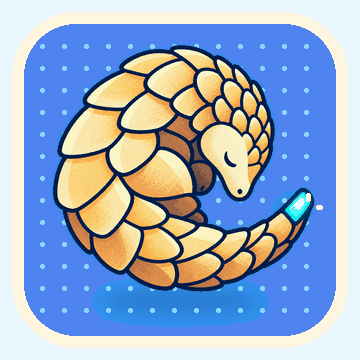

<p align="center">
  
</p>

<h1 align="center">Corta</h1>

<p align="center">
  An uncompromisingly native macOS terminal emulator, built from scratch in
  pure Swift — a hand-written VT engine, Metal rendering, first-class CJK
  input, and zero third-party dependencies.
</p>

<p align="center">
  <a href="LICENSE"></a>
  
  
  
</p>

<!--
TODO before the repository goes public: add a real screenshot at
docs/brand/screenshot.png (a live window running vim or tmux, dark theme,
2x resolution) and uncomment the block below. A terminal emulator without a
screenshot in its README is a terminal emulator nobody tries.

<p align="center">
  
</p>
-->

---

## What this is

Corta is a terminal emulator that targets exactly one platform and uses its
APIs directly: **Metal** for rendering, **Core Text** for shaping, **AppKit**
for the shell and input. The VT parser is written in Swift in this
repository rather than bound from C. There is no abstraction layer, no FFI,
and no dependency to audit.

That focus is the whole design. Every trade-off in `docs/DESIGN.md` follows
from it, and the things Corta deliberately does *not* do are listed there
just as carefully as the things it does.

**Small but resilient. Close to the system. Every character in its place.**

## Status

**M6 — 14 of 16 steps complete.** Milestones M1 through M5 are done. Corta
renders `vim`, `tmux` and `htop` correctly, handles splits, search, reflow,
selection, themes and CJK input, and is used daily by its author.

It has not had a tagged release yet. The two open M6 steps are latency
measurement with Typometer and notarised distribution — see
`docs/ROADMAP.md`, which is the tracking record.

Measured at the M6 close (`docs/PERFORMANCE.md` has the method):

| Metric                    | Target        | Measured |
| ------------------------- | ------------- | -------- |
| Frame CPU                 | < 4 ms        | 2.32 ms  |
| Parser throughput         | > 100 MB/s    | 75.1 MB/s |
| Idle CPU                  | ~0%           | 0.0%     |
| Memory, 100k × 120 lines  | ~200 MB       | 185.0 MB |
| `esctest` xterm conformance | —           | 73.2% (152 of 568 failing) |

Parser throughput is below its target and recorded as such. Numbers that
are not measured are left blank rather than estimated.

## Features

- **Hand-written VT engine** — VT100/VT220 through xterm-256color, true
  colour, DECRQM/DA/DSR query responses gated on the announced conformance
  level.
- **Metal rendering** — a GPU glyph atlas and instanced quads, one draw
  call per screen, a triple-buffered instance buffer, and no redraw at all
  when nothing changed.
- **First-class CJK** — full `NSTextInputClient` IME support with
  composition and candidate window, correct East Asian character widths,
  and Core Text font fallback.
- **Selection that understands wrapping** — document-anchored and stored in
  the core, so copying a soft-wrapped command gives you one line, and the
  selection follows its text as output scrolls.
- **Reflow** on resize, incremental across a 100k-line scrollback.
- **Splits, search, themes**, OSC 8 hyperlinks, bracketed paste, the kitty
  keyboard protocol, focus reporting, pinch-to-zoom and file drops.
- **A single text config file** at `~/.config/corta/config`. The native
  settings page is a front over that file, which stays the source of truth.

### Deliberately not here

A built-in multiplexer, cross-platform support, tmux control mode, AI
features, RTL text, and terminal title *query* responses (a command
injection vector — `docs/SECURITY.md` §2.2). Each was considered and
rejected for a stated reason in `docs/DESIGN.md` §6. Please read that
section before opening a feature request for one of them.

## Building

Corta needs **macOS 26.5 or later** and **Xcode 26** (Swift 6). There is no
package manager step — there are no dependencies.

```sh
git clone https://github.com/noah-qin/Corta.git
cd Corta
xcodebuild -project Corta.xcodeproj -scheme Corta build
xcodebuild -project Corta.xcodeproj -scheme Corta test
```

The terminal core is a local SwiftPM package that builds and tests without
an app:

```sh
swift build --package-path CortaTerminal -c release
swift test  --package-path CortaTerminal

# Parser throughput and scrollback memory
CortaTerminal/.build/release/corta-bench

# Replay the fuzz corpus, or mutate against it
CortaTerminal/.build/release/corta-fuzz --fuzz 500000 --seed 1 \
  CortaTerminal/Tests/Fuzz/corpus
```

There is no notarised build yet, so building it yourself is currently the
only way to run it. A signed release and a Homebrew cask are M6.16.

## Documentation

The documents are the source of truth for design decisions, not this file.

| Document              | Covers                                                       |
| --------------------- | ------------------------------------------------------------ |
| `docs/DESIGN.md`      | Goals, locked decisions, architecture, milestones, non-goals |
| `docs/ROADMAP.md`     | The ordered implementation plan and the tracking record       |
| `docs/CONFORMANCE.md` | Feature priorities, the daily-driver checklist, test strategy |
| `docs/PERFORMANCE.md` | Targets, hot-path rules, benchmarks                           |
| `docs/SECURITY.md`    | Threat model, escape-sequence injection, resource caps        |
| `CONTRIBUTING.md`     | Commit convention, branches, pull requests                    |

## Contributing

Issues and pull requests are welcome. Please read `CONTRIBUTING.md` first —
it covers the commit convention (Conventional Commits, English) and the
repository's working rules. Two of them catch newcomers out:

1. **App-layer changes are verified by launching the app.** Offscreen
   render tests cannot see view-hierarchy, orientation, startup-ordering or
   gesture defects; six such bugs shipped a blank window while every test
   stayed green. `docs/CONFORMANCE.md` §4.4 has the check.
2. **Measure the frame-CPU baseline after touching the render loop.** A
   0.9 ms regression once passed every test in the suite. Only the number
   caught it.

Contributions are accepted under the Apache License 2.0 (Section 5). There
is no separate CLA.

## Security

Every byte arriving from the PTY is treated as hostile. If you believe you
have found a vulnerability, **do not open a public issue** — see
`SECURITY.md` for how to report it privately. `docs/SECURITY.md` is the
threat model behind the rules.

## Licence

Source code is licensed under the [Apache License 2.0](LICENSE).

The **Corta** name, the pangolin mascot and the application icon are *not*
covered by that licence and remain the property of the copyright holder.
See `NOTICE`. Fork the code freely; re-brand your fork.

## The pangolin

Corta's mascot represents a simple engineering philosophy: compact,
precise, resilient, and close to the system.

Its curled body naturally forms the letter **C**, while its overlapping
scales resemble the cells of a terminal grid — small, efficient units
working together as a reliable whole. Its armour reflects Corta's focus on
stability and the secure handling of complex input. As a burrowing animal,
it also stands for going beneath the graphical surface and working directly
with the shell, processes and operating system.

The cyan tip of its tail is an active terminal cursor, always ready for the
next command.
