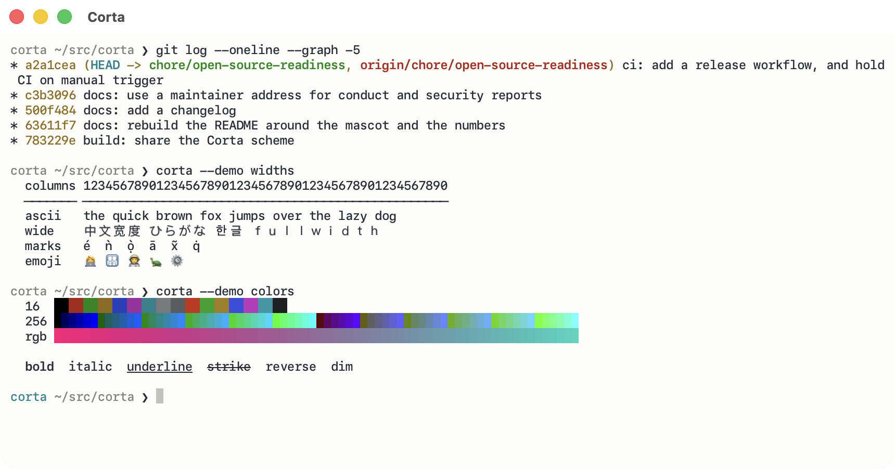

<div align="center">


# Corta

**An uncompromisingly native macOS terminal emulator.**

Built from scratch in pure Swift — a hand-written VT engine, Metal rendering,<br>
first-class CJK input, and not one third-party dependency.

<br>

[](LICENSE)


[](https://github.com/noah-qin/Corta/releases/latest)

<br>

*Small but resilient. Close to the system. Every character in its place.*

</div>

<div align="center">
  
</div>

---

## Why

<table>
<tr>
<td width="33%" valign="top">

### One platform

Metal for rendering, Core Text for shaping, AppKit for input. Used directly,
with no portability layer in between. Corta is made for macOS, so it can feel
at home there.

</td>
<td width="33%" valign="top">

### One language

The VT parser is written in Swift in this repository, not bound from C. No FFI, no bridging header, no dependency to audit — the whole program is readable end to end.

</td>
<td width="33%" valign="top">

### One job

Render a PTY correctly and quickly. No multiplexer, no cloud sync, no AI. Anything the operating system or `tmux` already does well, Corta does not reimplement.

</td>
</tr>
</table>

Every trade-off follows from those three lines. The decisions are written
down in [`docs/DESIGN.md`](docs/DESIGN.md) — including, at equal length, the
things Corta deliberately does **not** do.

## Status

**Version 0.1.0. Milestone 7 closed; M6 has one open step.** M1 through
M5 are done, M7 closed the places where Corta was still guessing — fonts,
command boundaries, and a window nobody could reopen. Corta renders `vim`,
`tmux` and `htop` correctly, and is used daily by its author.

Notarised direct distribution (M6.16) is the sole open step.
[`docs/ROADMAP.md`](docs/ROADMAP.md) is the tracking record.

Measured after M7 — the method is in
[`docs/PERFORMANCE.md`](docs/PERFORMANCE.md):

| Metric | Target | Measured | |
| :--- | :--- | :--- | :--- |
| Frame CPU | < 4 ms | **1.88 ms** | ✅ |
| Idle CPU | ~0% | **0.0%** | ✅ |
| Memory, 100k × 120 lines | ~200 MB | **185.0 MB** | ✅ |
| Core feed throughput | > 100 MB/s | **130.0 MiB/s** (5-run mean) | ✓ |
| Keypress → pixel | < 1 frame + input | **45.5 ms avg** | ⚠️ above target |
| `esctest` xterm conformance | — | **77.6%** — 127 of 568 failing | |

The number that misses its target is printed here rather than omitted.
Numbers that have not been measured are left blank rather than estimated.

## Features

**The engine**
- A hand-written VT parser: VT100/VT220 through `xterm-256color`, true colour,
  and query responses — DA, DSR, DECRQM — gated on the conformance level the
  program announced.
- Lines carry a `wrapped` flag from the first commit, so reflow, selection
  and search all agree about where a logical line begins and ends.
- Cells are 16 bytes; complex graphemes spill to an interned side table.

**The rendering**
- A GPU glyph atlas and instanced quads: one draw call per screen, a
  triple-buffered instance buffer, and damage tracked per line.
- Nothing is redrawn when nothing changed — idle CPU is 0.0%, not "low".

**The text**
- Full `NSTextInputClient` IME: composition, a candidate window that lands
  under the cursor in any split, and preedit drawn as an overlay that never
  touches the grid.
- Correct East Asian widths, combining marks and emoji presentation, with
  Core Text font fallback.

**The window**
- Splits, search across the scrollback, incremental reflow on resize,
  document-anchored selection that follows its text as output scrolls.
- OSC 8 hyperlinks, bracketed paste, the kitty keyboard protocol, focus
  reporting, pinch-to-zoom, file drops, colour themes.
- Windows, splits and per-pane working directories are restored at launch,
  and closing something that still has a job running asks first.
- A command palette (⇧⌘P) over every command, which is also the list the
  menus and the keybindings are generated from.

**The shell**
- OSC 133 shell integration: a status mark beside each prompt showing
  which commands failed, ⌘↑/⌘↓ to jump between them, and a long-task
  notification that fires on the real boundary rather than a guess.
- OSC 52 clipboard *write* — how `tmux` and a remote `ssh` reach this
  Mac's clipboard. Off by default; the read direction does not exist.

**The configuration**
- One text file at `~/.config/corta/config`. The native settings page is a
  front over that file, which stays the single source of truth — hand-edit
  it and the page follows.
- Colour themes and keyboard shortcuts are defined there too:

  ```
  theme = midnight
  theme.midnight.inherit = solarized
  theme.midnight.dark.background = #101018

  bind.split-right = ctrl+s
  bind.command-palette = cmd+shift+p
  bind.close =              # an empty value unbinds
  ```

<details>
<summary><strong>What Corta deliberately does not do</strong></summary>

<br>

A built-in multiplexer, cross-platform support, tmux control mode, AI
features, RTL text, and terminal title *query* responses — the last being a
command injection vector, [`docs/SECURITY.md`](docs/SECURITY.md) §2.2.

Each was considered and rejected for a stated reason in
[`docs/DESIGN.md`](docs/DESIGN.md) §6. Please read it before opening a
feature request for one of them.

Deferred rather than rejected: the kitty graphics protocol, whose cost went
*up* when the cell filled. OSC 133 shell integration was on this list and
shipped in M7 — prompt and exit-status marks, command-to-command jumping,
and an exact long-task notification.

</details>

## Building

Corta needs **macOS 26.5 or later** and **Xcode 26** (Swift 6). There is no
dependency step, because there are no dependencies.

```sh
git clone https://github.com/noah-qin/Corta.git
cd Corta
xcodebuild -project Corta.xcodeproj -scheme Corta build
xcodebuild -project Corta.xcodeproj -scheme Corta test
```

The terminal core is a local SwiftPM package that builds, tests and
benchmarks without an app:

```sh
swift test --package-path CortaTerminal
swift build --package-path CortaTerminal -c release

# Parse throughput and scrollback memory
CortaTerminal/.build/release/corta-bench

# Replay the checked-in fuzz corpus, then mutate against it
CortaTerminal/.build/release/corta-fuzz --fuzz 500000 --seed 1 \
  CortaTerminal/Tests/Fuzz/corpus
```

There is no notarised build yet, so building it yourself is currently the
only way to run it.

## Documentation

The documents are the source of truth for design decisions; this file is an
index.

| Document | Covers |
| :--- | :--- |
| [`docs/DESIGN.md`](docs/DESIGN.md) | Goals, locked decisions, architecture, milestones, non-goals |
| [`docs/ROADMAP.md`](docs/ROADMAP.md) | The ordered implementation plan and the tracking record |
| [`docs/CONFORMANCE.md`](docs/CONFORMANCE.md) | Feature priorities, the daily-driver checklist, test strategy |
| [`docs/PERFORMANCE.md`](docs/PERFORMANCE.md) | Targets, hot-path rules, benchmarks |
| [`docs/SECURITY.md`](docs/SECURITY.md) | Threat model, escape-sequence injection, resource caps |
| [`CONTRIBUTING.md`](CONTRIBUTING.md) | Commit convention, branches, pull requests |
| [`CHANGELOG.md`](CHANGELOG.md) | What changed, per release |

## Contributing

Issues and pull requests are welcome. Read
[`CONTRIBUTING.md`](CONTRIBUTING.md) first — it covers the commit convention
(Conventional Commits, English) and the working rules. Two of those catch
newcomers out, and both were learned the expensive way:

> **App-layer changes are verified by launching the app.** Offscreen render
> tests cannot see view-hierarchy, orientation, startup-ordering or gesture
> defects. Six such bugs shipped a blank window while every test stayed
> green.

> **Re-measure the frame-CPU baseline after touching the render loop.** A
> 0.9 ms regression once passed the entire suite. Only the number caught it.

Contributions are accepted under Apache 2.0 §5. There is no separate CLA.

## Security

Every byte arriving from the PTY is treated as hostile. If you believe you
have found a vulnerability, **do not open a public issue** —
[`SECURITY.md`](SECURITY.md) has the private channel, and
[`docs/SECURITY.md`](docs/SECURITY.md) is the threat model behind it.

## Licence

Source code is under the [Apache License 2.0](LICENSE).

The **Corta** name, the pangolin mascot and the application icon are *not*
covered by that licence and remain the property of the copyright holder —
see [`NOTICE`](NOTICE). Fork the code freely; re-brand your fork.

---

<div align="center">


### The pangolin

</div>

Corta's mascot stands for a simple engineering philosophy: compact, precise,
resilient, and close to the system.

Its curled body naturally forms the letter **C**, while its overlapping
scales resemble the cells of a terminal grid — small, efficient units
working together as a reliable whole. Its armour reflects Corta's focus on
stability and the secure handling of complex input. As a burrowing animal,
it also stands for going beneath the graphical surface, down to the shell,
the processes and the operating system.

The cyan tip of its tail is an active terminal cursor, always ready for the
next command.
