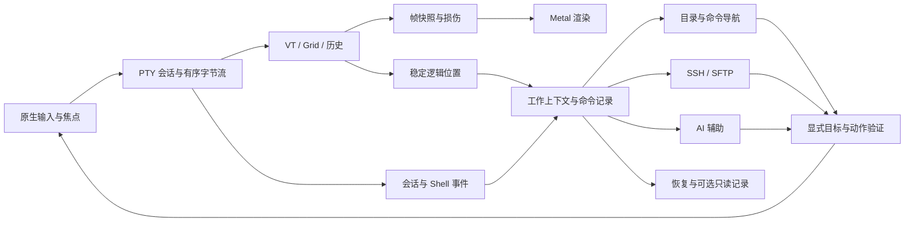

# Corta 下一代终端改进计划

> 状态：已接受的产品与工程规划，尚未实施。编号 1–100 与本轮产品分析一一对应。
> 基线：Corta 0.1.1，提交 `b6e6deddf00df095f03c18d5c0bf4b9312403533`。
> 记录日期：2026-09-10。规划分支：`codex/next-generation-terminal-plan`。
> 本次改动仅编写规划与导航说明，不代表下列缺陷已修复、性能已提升或新功能已交付。

## 阅读方式

本文面向维护者与贡献者，也为用户解释每项改进的实际作用。每项包含含义与价值、
实施范围、验收标准、现有证据状态和关联项。编号是稳定引用，后续 issue、PR、测试
可以引用“计划 #49”，不随排期改变；100 项不是按编号串行执行的 100 个提交。

- **P0**：输入、内容、权限、生命周期与性能基线等基础条件，阻止受影响能力发布。
- **P1**：成为可靠主力终端和建立核心竞争力所需的工作。
- **P2**：增强能力，仍属接受范围，依资源、依赖与验证安排交付。
- **实验**：积极制作可运行原型，以正确性与数据决定默认启用、回退或结束实验。
- **代码风险**：通过实现检查发现具体路径，未等同实机复现。
- **规划**：新增或改造建议，不代表当前存在缺陷。
- **关联项**：互相影响的设计或验证工作，不是有向前置依赖，允许互相引用。
- **阶段**：建议落地阶段；跨阶段项先交付最小闭环，继续扩展。

## 产品目标与边界

Corta 的目标是以低延迟、准确的终端为基础，理解目录、命令、远程环境和 AI 任务的
macOS 原生工作台。CJK 继续作为基础质量要求，而不是唯一人群定位。

本轮明确接受 AI、智能目录导航、SSH/SFTP、最新平台适配以及前两轮全部产品建议。
这更新了旧设计里绝对的“No AI”限制，以及排斥上述辅助工作流的旧范围表述。
本规划不自动引入跨平台、内建多路复用器、云同步或无限制远程命令执行。

终端核心继续保持 Swift、平台原生输入和渲染、明确字节顺序、正确 VT 语义及资源上限。
AI/远程辅助模块不能成为基本输入与显示的前提。第三方服务、依赖和模型分发方式
需要具体实现决策；本轮不承诺特定云模型免费，也不改变现有应用的最低系统版本。

## 证据与已知状态

这是一轮源码检查、已有记录整理与官方资料研究，未重新执行完整 UI、兼容性或性能测试。

| 项目 | 当前可确认状态 | 不应推导出的结论 |
| --- | --- | --- |
| 工具链 | 选中 Swift 6.3.3 / Xcode 26.6；包 tools 6.2，部署目标 macOS 26.0 | 不代表已用 macOS 27 SDK 编译运行 |
| 平台研究 | 已阅读 Swift 6.3 与 macOS 27/WWDC26 相关官方资料 | API 名称、availability、硬件和分发条件仍需实施时再次确认 |
| Metal 4 | `Metal4Backend` 当前转发到 `QuadRenderer` | 不算真实 Metal 4 提交后端，也不能宣称速度收益 |
| 兼容性 | 2026-09-08：112 passed、335 known bugs、121 failed / 568 | known bugs 为套件分类；78.7% 不是实际应用成功率 |
| 颜色缺口 | 已分类的 45 项颜色相关失败；OSC 4/5 等语义需补齐 | 不保证实现单个分支即可让 45 项全部通过 |
| 其他候选 | 维护者整理约 22 项值得修；28 项窗口操作属主动限制 | 三组不是全部 121 项，不能直接相加作为完整覆盖 |
| 翻译 | 41 条新增翻译完成格式校验，未母语复核 | 不代表语言自然度已通过 |
| VoiceOver | 坐标/字幕等部分通过，40 行朗读是否漏读/重复未判定 | 不得把部分通过标成整项完成 |
| 缩放拉伸 | 维护者反馈“基本没有了” | 不是确定完全修复 |
| 字体目录 | 偶发系统查询失败伴随 MDB_MAP_FULL，可导致回退 | 系统现象未修，测试分类不能代替产品恢复机制 |
| UI / CI | UI 测试未进入 CI，是现有明确决定 | 不能当作误配置；也不代表不用人工 UI 验收 |
| 打包 | T11 脚本/工作流检查仍有重复实现 | 尚未完成统一 |
| 性能 | 历史 45.5ms 与其他环境约 70ms 记录不能做受控前后对比 | 没有当前版本整体领先/落后的新结论 |

已修复的旧问题不因出现在历史文档就重新打开；旧清单未勾选也不自动证明当前实现缺失。
实施前检查具体版本、复现证据和既有测试。

## 架构方向

以下是目标边界，不是已存在的类型或承诺的新包数量。



输入与渲染路径不等待 AI、目录索引或网络服务；动作回流必须明确目标和权限。
结构化上下文保存来源和未知状态；不把远程提示文字当成本地可信路径。
暂时状态、全局偏好、启动配置分别有所有者，避免一个设置变化影响所有窗口。
稳定位置同时用于视口、选择、搜索、命令与图片，避免各模块用不同的相对行号。

## 分阶段交付与实际依赖

| 阶段 | 交付闭环 | 必要前提 | 出口标准 |
| --- | --- | --- | --- |
| A 可靠性与基线 | 持续输出下读得住、选得准、输入不静默丢失；可复查基线 | 固定复现环境与现有版本快照 | P0 场景完成，记录剩余未判定项；人工启动验证 |
| B 上下文与主力体验 | Shell 集成、指定命令操作、智能目录、恢复、设置与文档 | A 的稳定位置和输入路由；上下文模型先定义再接消费者 | 一次本地排错与恢复流程端到端完成 |
| C 远程与 AI | SSH/SFTP 闭环、最小 AI 辅助、上下文预览和正确目标 | B 的会话/命令身份；权限与取消先于执行工具 | 远程失败/断线和 AI 不可用均不影响基础终端 |
| D 平台与性能 | 新 AppKit/SwiftUI 能力，定向 CPU/内存/GPU 实验 | 每次实验前的 A 基线与正确性案例 | 真实实现、同条件结果、启用/回退决定和支持范围 |
| E 开源交付与验证 | 用户文档、可复查发布、演示与实际用户反馈 | 可用的端到端能力 | 用户可安装、迁移和报告问题；不夸大未完成状态 |

D 可以与受影响组件的 A/B/C 工作穿插，但必须先有对应实验基线。
E 的文档和发布维护应持续进行，不必等所有增强功能结束。
本规划不将全部工作压入 0.1.2；0.1.2 可优先承接已分类兼容性和可靠性工作，
后续版本根据完整工作流安排，版本号与发布日期待发布范围确定后决定。

### 性能实验的共同规则

1. 明确要改善的场景、瓶颈假设和主指标；记录其他指标作为防退化条件。
2. 固定机器、系统、编译优化、字体/窗口/刷新率、Shell、终端版本、电源和热状态。
3. 先量当前路径，再量新路径；保留超时与失败，不挑选成功样本制造优势。
4. 输入采用外部端到端测量和内部 trace；CPU 完成/GPU 完成都不能直接代表像素已显示。
5. 正确性先通过，再按超出测量噪声的收益决定启用；无收益实验可结束但要保留结论。
6. 全面“最快”需声明对照集合和工作负载范围；禁止从单项 MB/s 推导整体最快。

## 100 项索引

| 编号 | 改进 | 优先级 | 阶段 |
| --- | --- | --- | --- |
| [1](#item-001) | 把“最新、最快、跨时代”转成可验收目标 | P1 | A |
| [2](#item-002) | 面向本地、远程与 AI 开发工作流 | P1 | B |
| [3](#item-003) | 统一工作上下文 | P1 | B |
| [4](#item-004) | 命令记录与终端网格分离 | P1 | B |
| [5](#item-005) | 更新产品约束与演进边界 | P1 | A |
| [6](#item-006) | 现有 AI CLI 的完整运行体验 | P1 | C |
| [7](#item-007) | 面向任务的 AI 操作 | P1 | C |
| [8](#item-008) | 可查看、可裁剪的 AI 上下文 | P0 | C |
| [9](#item-009) | 生成、填入与执行分离 | P0 | C |
| [10](#item-010) | 可靠的 AI 任务状态 | P1 | C |
| [11](#item-011) | 统一模型接入层 | P2 | C |
| [12](#item-012) | 按能力降级的本地 AI | P2 | C |
| [13](#item-013) | AI 独立资源预算 | P0 | C |
| [14](#item-014) | AI 质量评测 | P1 | C |
| [15](#item-015) | 稳定与预览工具链验证 | P1 | A/D |
| [16](#item-016) | 区分编译器、语言模式与部署版本 | P1 | A |
| [17](#item-017) | Swift 6.3 定向优化控制 | P2 | D |
| [18](#item-018) | 现代内存 API | P1 | D |
| [19](#item-019) | 显式并发与隔离边界 | P1 | A/D |
| [20](#item-020) | Swift Testing 诊断升级 | P1 | A/D |
| [21](#item-021) | 原生文本选择管理器 | P2 | D |
| [22](#item-022) | 现代化鼠标事件处理 | P1 | A/D |
| [23](#item-023) | 统一系统圆角与玻璃材质 | P1 | D |
| [24](#item-024) | 渐进采用 SwiftUI | P1 | D |
| [25](#item-025) | 原生工具栏与标签语义 | P2 | D |
| [26](#item-026) | 平台性能诊断升级 | P1 | D |
| [27](#item-027) | 系统级操作入口 | P2 | D |
| [28](#item-028) | 开箱可用的 Shell 集成 | P1 | B |
| [29](#item-029) | 智能目录导航 | P1 | B |
| [30](#item-030) | 切换正确会话的工作目录 | P0 | B |
| [31](#item-031) | Finder 与路径上下文操作 | P2 | B |
| [32](#item-032) | 按上下文检索命令历史 | P2 | B/C |
| [33](#item-033) | 复用 OpenSSH 配置 | P1 | C |
| [34](#item-034) | 显式远程上下文 | P1 | C |
| [35](#item-035) | SFTP 文件浏览 | P1 | C |
| [36](#item-036) | 可控且可恢复的文件传输 | P1 | C |
| [37](#item-037) | SSH/SFTP 连接与认证复用 | P2 | C |
| [38](#item-038) | 诚实的断线恢复 | P1 | C |
| [39](#item-039) | 远程文件编辑闭环 | P2 | C |
| [40](#item-040) | 固定历史阅读位置 | P0 | A |
| [41](#item-041) | 输入时回到底部的规则 | P1 | A |
| [42](#item-042) | 统一重排后的逻辑锚点 | P0 | A |
| [43](#item-043) | 历史淘汰反馈 | P1 | A |
| [44](#item-044) | 关闭搜索后继续阅读 | P1 | A |
| [45](#item-045) | 限定搜索 Escape 的作用范围 | P0 | A |
| [46](#item-046) | 搜索状态局部化 | P1 | A |
| [47](#item-047) | 默认显式复制 | P1 | A |
| [48](#item-048) | 终端选择与 TUI 鼠标共存 | P0 | A |
| [49](#item-049) | 选区高亮与复制内容一致 | P0 | A |
| [50](#item-050) | 明确上一条与指定命令输出 | P1 | B |
| [51](#item-051) | 操作正在运行的输出 | P1 | B/C |
| [52](#item-052) | 长预编辑与复杂输入法 | P1 | A |
| [53](#item-053) | 输入法与焦点生命周期 | P1 | A |
| [54](#item-054) | 局部缩放与默认字号分离 | P1 | A/B |
| [55](#item-055) | 恢复启动配置与工作组织 | P1 | B |
| [56](#item-056) | 重开记录与可选只读历史 | P2 | B |
| [57](#item-057) | 连贯的排错流程 | P1 | B |
| [58](#item-058) | 补齐颜色协议缺口 | P1 | A |
| [59](#item-059) | 修复值得实施的兼容性行为 | P1 | A |
| [60](#item-060) | 兼容性报告保留产品边界 | P1 | A |
| [61](#item-061) | 翻译语言审校 | P1 | A/B |
| [62](#item-062) | 完成 VoiceOver 长输出验收 | P1 | A |
| [63](#item-063) | 持续验证缩放拉伸 | P1 | A/D |
| [64](#item-064) | 字体目录暂时失败的可见降级 | P1 | A |
| [65](#item-065) | 字体与主题的可用入口 | P1 | B |
| [66](#item-066) | 建立当前性能基线 | P0 | A |
| [67](#item-067) | 拆解按键到像素链路 | P0 | A/D |
| [68](#item-068) | 帧调度与排队深度实验 | P1 | D |
| [69](#item-069) | 降低解析与视图锁竞争 | P1 | D |
| [70](#item-070) | 降低快照写时复制成本 | P1 | D |
| [71](#item-071) | ASCII 连续文本快速路径 | P2 | D |
| [72](#item-072) | 损伤跟踪覆盖 GPU 上传 | P1 | D |
| [73](#item-073) | 减少冗余渲染 pass | P2 | D |
| [74](#item-074) | 真正实现 Metal 4 提交路径 | P2 | D |
| [75](#item-075) | 减少多分屏重复资源 | P1 | D |
| [76](#item-076) | 字形缓存与冷路径优化 | P1 | D |
| [77](#item-077) | 搜索结果新鲜度与增量刷新 | P1 | A/D |
| [78](#item-078) | 输入背压不再静默丢弃 | P0 | A |
| [79](#item-079) | 大复制导出与高频落盘移出交互路径 | P1 | A/D |
| [80](#item-080) | 能耗与长时间持续性能 | P1 | D |
| [81](#item-081) | 按状态所有权拆分大控制器 | P1 | A/B |
| [82](#item-082) | 明确核心与服务模块边界 | P1 | A/B |
| [83](#item-083) | 统一取消与资源生命周期 | P0 | A |
| [84](#item-084) | 基于可达性的死代码审查 | P1 | D |
| [85](#item-085) | 清理模板与占位实现 | P2 | A/D |
| [86](#item-086) | 精简注释，保留设计理由 | P1 | B/D |
| [87](#item-087) | 消除过时及矛盾说明 | P1 | A/B |
| [88](#item-088) | 统一配置声明和作用范围 | P1 | B |
| [89](#item-089) | 窄窗口与多分屏布局 | P1 | B/D |
| [90](#item-090) | 统一原生交互细节 | P1 | A/B |
| [91](#item-091) | Quick Terminal 与系统兼容 | P2 | D |
| [92](#item-092) | 面向开源用户重建文档 | P1 | B |
| [93](#item-093) | 同步下载和能力说明 | P1 | A |
| [94](#item-094) | 可维护的开发者文档与 DocC | P2 | B/D |
| [95](#item-095) | 保持明确的人工 UI 验收门槛 | P1 | A |
| [96](#item-096) | 统一打包检查 T11 | P1 | A |
| [97](#item-097) | 真实工作流回归集合 | P1 | A |
| [98](#item-098) | 可复现质量与性能证据 | P1 | A/D |
| [99](#item-099) | 展示与真实用户验证 | P2 | E |
| [100](#item-100) | 分阶段交付完整工作流 | P1 | A–E |

## 逐项实施说明

<a id="item-001"></a>

### 1. 把“最新、最快、跨时代”转成可验收目标

**优先级：P1｜证据状态：规划｜建议阶段：A｜关联项：—**

- **是什么意思、有什么用：** 最新是利用合适的公开平台能力；最快需要分开衡量响应、吞吐和资源消耗；跨时代是明显减少用户完成任务的步骤。
- **具体怎么做：** 制定输入、负载输入、滚动、启动、吞吐、内存、能耗和可靠性指标；分别规定测量方法、对照版本和发布条件。
- **怎样算完成：** 每个性能结论附完整环境与原始结果；总体领先只能在已定义工作负载内表述，不能用解析吞吐代替输入延迟。
- **实施状态：** 未在本规划分支实施。完成时填写实现 PR/提交、验证记录与剩余限制。


<a id="item-002"></a>

### 2. 面向本地、远程与 AI 开发工作流

**优先级：P1｜证据状态：规划｜建议阶段：B｜关联项：1**

- **是什么意思、有什么用：** 用户可以在同一产品中完成本地开发、远程排错和 AI 辅助；CJK 是基础质量，而不是唯一受众边界。
- **具体怎么做：** 定义典型用户和端到端任务，覆盖本地构建、远程日志、文件传输、AI 解释输出；所有增强能力可按需打开。
- **怎样算完成：** 每个功能能对应具体任务；仅使用普通 Shell 的用户不会被额外面板、账号流程或模型加载打断。
- **实施状态：** 未在本规划分支实施。完成时填写实现 PR/提交、验证记录与剩余限制。


<a id="item-003"></a>

### 3. 统一工作上下文

**优先级：P1｜证据状态：规划｜建议阶段：B｜关联项：40、42、55**

- **是什么意思、有什么用：** 用结构化数据知道当前分屏、目录、项目、主机、Shell 和任务，避免各模块从屏幕文字猜测。
- **具体怎么做：** 设计 ContextSnapshot 与稳定的 pane/session/command ID；记录来源、更新时间和可信程度；本地与远端目录分开，允许 unknown。
- **怎样算完成：** 切分屏、进入嵌套 SSH、改变目录和重连后，所有操作使用同一上下文版本；未知状态不伪装成已确认。
- **实施状态：** 未在本规划分支实施。完成时填写实现 PR/提交、验证记录与剩余限制。


<a id="item-004"></a>

### 4. 命令记录与终端网格分离

**优先级：P1｜证据状态：规划｜建议阶段：B｜关联项：3、28、42**

- **是什么意思、有什么用：** 网格回答屏幕上有什么，命令记录回答哪次执行产生了什么；这使复制、搜索、AI 和恢复能指向同一次任务。
- **具体怎么做：** 设计轻量 CommandRecord，关联起止逻辑位置、退出状态和上下文；缺失 OSC 标记时降级，不向 Cell 盲目增加字段。
- **怎样算完成：** 连续短命令、长输出、多行提示符和无集成 TUI 都有明确行为；语义记录不改变 VT 输出顺序。
- **实施状态：** 未在本规划分支实施。完成时填写实现 PR/提交、验证记录与剩余限制。


<a id="item-005"></a>

### 5. 更新产品约束与演进边界

**优先级：P1｜证据状态：已接受方向变更｜建议阶段：A｜关联项：1、2**

- **是什么意思、有什么用：** 本轮明确接受 AI、SSH/SFTP 和智能导航，旧文档的绝对 No AI 等表述不能继续作为拒绝依据。
- **具体怎么做：** 保留原生 macOS、Swift 核心、终端正确性与资源边界；将 AI/远程服务放在核心之外，记录需要重新决策的依赖和分发策略。
- **怎样算完成：** 设计文档标明旧约束的适用时期；能力规划、实验、默认启用与正式交付各有独立状态。
- **实施状态：** 未在本规划分支实施。完成时填写实现 PR/提交、验证记录与剩余限制。


<a id="item-006"></a>

### 6. 现有 AI CLI 的完整运行体验

**优先级：P1｜证据状态：待验证｜建议阶段：C｜关联项：40–54、97**

- **是什么意思、有什么用：** 支持 AI 不只是加聊天入口，还包括让用户已有的编码 CLI 在 Corta 中长期稳定运行。
- **具体怎么做：** 建立流式输出、长输入、CJK、鼠标模式、组合键、同步输出、图片与长会话案例；记录准确 CLI 版本。
- **怎样算完成：** 既能读旧输出又能接收新输出；无错屏、丢输入或快捷键误路由；没有官方状态接口时只展示可确认的信息。
- **实施状态：** 未在本规划分支实施。完成时填写实现 PR/提交、验证记录与剩余限制。


<a id="item-007"></a>

### 7. 面向任务的 AI 操作

**优先级：P1｜证据状态：规划｜建议阶段：C｜关联项：3、4、8、9、11**

- **是什么意思、有什么用：** 把解释错误、总结输出、生成命令和比较运行结果放在任务旁边，减少复制上下文和切换应用。
- **具体怎么做：** 先实现对选定命令输出的解释与摘要，再提供生成命令和两次运行比较；回答标注所依据的执行与输出范围。
- **怎样算完成：** 操作目标可预览；切换焦点后结果仍关联原任务；请求可以取消、重试，错误不会影响终端输入。
- **实施状态：** 未在本规划分支实施。完成时填写实现 PR/提交、验证记录与剩余限制。


<a id="item-008"></a>

### 8. 可查看、可裁剪的 AI 上下文

**优先级：P0｜证据状态：规划｜建议阶段：C｜关联项：3、4**

- **是什么意思、有什么用：** 用户知道哪些内容会交给模型，避免模型缺上下文，也避免整份日志和环境信息被无意发送。
- **具体怎么做：** 提供命令、目录、主机、选区和输出范围预览；默认最小上下文、敏感字段过滤与可编辑裁剪；说明数据去向。
- **怎样算完成：** 不默认读取完整环境变量、密钥文件或所有历史；用户移除的内容不进入请求；日志文本不能提升工具权限。
- **实施状态：** 未在本规划分支实施。完成时填写实现 PR/提交、验证记录与剩余限制。


<a id="item-009"></a>

### 9. 生成、填入与执行分离

**优先级：P0｜证据状态：规划｜建议阶段：C｜关联项：3、8**

- **是什么意思、有什么用：** AI 建议不等于执行授权；用户能在正确主机和目录检查命令后再运行。
- **具体怎么做：** 定义解释、生成、填入、执行动作；执行入口绑定会话 ID 与上下文版本，目标变动需重新确认；自动化权限独立建模。
- **怎样算完成：** 未知目录、会话已关闭或目标主机变化时不执行；命令和操作目标均可检查，执行仍遵守 PTY 字节顺序。
- **实施状态：** 未在本规划分支实施。完成时填写实现 PR/提交、验证记录与剩余限制。


<a id="item-010"></a>

### 10. 可靠的 AI 任务状态

**优先级：P1｜证据状态：规划｜建议阶段：C｜关联项：3、4、6**

- **是什么意思、有什么用：** 让用户知道任务是否运行、等待交互或结束，不用盯着每个分屏。
- **具体怎么做：** 优先接官方事件、退出状态或明确集成；对纯文本 CLI 保留状态未知，不靠输出静默、颜色或提示文字断言完成。
- **怎样算完成：** 完成与等待通知能追溯来源；没有可靠来源时明确降级；不把外层 Shell 命令状态当作内部每个 AI 子任务状态。
- **实施状态：** 未在本规划分支实施。完成时填写实现 PR/提交、验证记录与剩余限制。


<a id="item-011"></a>

### 11. 统一模型接入层

**优先级：P2｜证据状态：官方能力已查，待原型｜建议阶段：C｜关联项：8、9、13、15**

- **是什么意思、有什么用：** 把上下文与任务 UI 从具体模型提供商中解耦，使本地和云端能力可替换。
- **具体怎么做：** 评估 Foundation Models 的 LanguageModel 和 Dynamic Profiles；封装流式生成、工具调用、取消、用量与错误；认证信息采用合适系统存储。
- **怎样算完成：** 至少完成一个可运行适配与失败降级；模型切换不混淆权限、上下文与费用，确认 SDK/运行时 availability。[S4]
- **实施状态：** 未在本规划分支实施。完成时填写实现 PR/提交、验证记录与剩余限制。


<a id="item-012"></a>

### 12. 按能力降级的本地 AI

**优先级：P2｜证据状态：实验｜建议阶段：C｜关联项：11、13、14**

- **是什么意思、有什么用：** 在支持的机器上本地完成摘要或解释，降低外部依赖；普通终端不依赖模型可用。
- **具体怎么做：** 评估系统模型，必要时评估 Core AI 自带模型路线；检查硬件、系统、地区语言、用户设置与授权条件。
- **怎样算完成：** 冷加载、峰值内存、质量和取消都有记录；不可用时给出原因，禁用 AI 后不驻留模型。[S5]
- **实施状态：** 未在本规划分支实施。完成时填写实现 PR/提交、验证记录与剩余限制。


<a id="item-013"></a>

### 13. AI 独立资源预算

**优先级：P0｜证据状态：规划｜建议阶段：C｜关联项：3、80、82、83**

- **是什么意思、有什么用：** 生成摘要和建立索引不能拖慢用户每次按键，也不能让终端内存失控。
- **具体怎么做：** 约束请求并发、输入大小、模型内存、后台索引与缓存；设置取消与生命周期；评估独立服务或进程是否值得其成本。
- **怎样算完成：** 输入/滚动在 AI 运行时仍满足基线预算；关闭分屏或禁用 AI 后资源释放；压力下增强功能先降级。
- **实施状态：** 未在本规划分支实施。完成时填写实现 PR/提交、验证记录与剩余限制。


<a id="item-014"></a>

### 14. AI 质量评测

**优先级：P1｜证据状态：官方能力已查，待实现｜建议阶段：C｜关联项：7–12**

- **是什么意思、有什么用：** 模型回答质量会随提示词、模型和上下文变化，需要可重复评估，而不只看一次演示。
- **具体怎么做：** 建立固定错误解释、命令生成、路径选择、远程目标和提示注入案例；评估 Evaluations framework，保留人工判断标准。
- **怎样算完成：** 比较改动前后成功率、错误执行建议、成本与时延；不以模型自己的评分作为唯一依据。[S4]
- **实施状态：** 未在本规划分支实施。完成时填写实现 PR/提交、验证记录与剩余限制。


<a id="item-015"></a>

### 15. 稳定与预览工具链验证

**优先级：P1｜证据状态：规划｜建议阶段：A/D｜关联项：1、98**

- **是什么意思、有什么用：** 主动采用新技术，同时知道发布构建来自哪个编译器和 SDK。
- **具体怎么做：** 固定发布工具链版本，增加 Xcode 27/macOS 27 兼容路径；检查 SDK 声明、设备需求、最低系统后果；不自动升级开发者机器。
- **怎样算完成：** 记录 compiler、SDK、runtime 与硬件；新 API 在目标系统跑过，兼容分支有明确保留理由和移除条件。[S2][S3]
- **实施状态：** 未在本规划分支实施。完成时填写实现 PR/提交、验证记录与剩余限制。


<a id="item-016"></a>

### 16. 区分编译器、语言模式与部署版本

**优先级：P1｜证据状态：已检查现状｜建议阶段：A｜关联项：15**

- **是什么意思、有什么用：** swift-tools-version 不是编译器版本；更换 SDK 也不等于必须提高最低系统版本。
- **具体怎么做：** 记录当前选中 Swift 6.3.3/Xcode 26.6、包 tools 6.2 与 macOS 26.0 目标；按采用能力分别升级并验证。
- **怎样算完成：** CI、本地与文档能够解释四者关系；不把只改版本号称为完成迁移。
- **实施状态：** 未在本规划分支实施。完成时填写实现 PR/提交、验证记录与剩余限制。


<a id="item-017"></a>

### 17. Swift 6.3 定向优化控制

**优先级：P2｜证据状态：实验｜建议阶段：D｜关联项：66、67、71**

- **是什么意思、有什么用：** 对实际热点使用更精确的特化和内联，减少泛型及跨模块开销。
- **具体怎么做：** 评估 @specialize、@inline(always)、@export(implementation)；检查生成代码、二进制体积与调用热点，逐项 A/B。
- **怎样算完成：** 相同负载有可重复收益，未显著增加启动或指令缓存成本；没有收益的标注不保留。[S1]
- **实施状态：** 未在本规划分支实施。完成时填写实现 PR/提交、验证记录与剩余限制。


<a id="item-018"></a>

### 18. 现代内存 API

**优先级：P1｜证据状态：部分已有，继续评估｜建议阶段：D｜关联项：69、70、71**

- **是什么意思、有什么用：** 用可验证的生命周期和连续内存访问减少不安全指针及不必要分配。
- **具体怎么做：** Parameters 已用 InlineArray；评估 Span、借用和严格内存安全检查，限定在缓冲区边界与热路径。
- **怎样算完成：** 正确性、生命周期和分配数据均通过验证；这些主要是 Swift 6.2 能力，不误标为 6.3 新增。[S6]
- **实施状态：** 未在本规划分支实施。完成时填写实现 PR/提交、验证记录与剩余限制。


<a id="item-019"></a>

### 19. 显式并发与隔离边界

**优先级：P1｜证据状态：审查项｜建议阶段：A/D｜关联项：81–83**

- **是什么意思、有什么用：** 知道每份状态由谁修改，减少锁、竞态和主线程意外工作。
- **具体怎么做：** 审查 unchecked/unsafe 隔离声明；划分 UI、PTY 读取、解析、搜索、解码和 AI 的执行位置；阻塞 I/O 不占协作式执行器。
- **怎样算完成：** 每个共享状态有所有者和同步理由；关闭、取消、回调晚到、持续输出场景无竞态且不丢事件。
- **实施状态：** 未在本规划分支实施。完成时填写实现 PR/提交、验证记录与剩余限制。


<a id="item-020"></a>

### 20. Swift Testing 诊断升级

**优先级：P1｜证据状态：官方能力已查，待采用｜建议阶段：A/D｜关联项：95、97、98**

- **是什么意思、有什么用：** 失败时保留图像和上下文，区分系统环境不可用与产品逻辑错误。
- **具体怎么做：** 使用图像附件、测试取消、warning 等适合能力；保留真正错误的失败状态，使用参数化用例覆盖边界。
- **怎样算完成：** 渲染失败可查看附件；字体系统暂不可用单独分类；真实回归不被跳过或降成 warning。[S1]
- **实施状态：** 未在本规划分支实施。完成时填写实现 PR/提交、验证记录与剩余限制。


<a id="item-021"></a>

### 21. 原生文本选择管理器

**优先级：P2｜证据状态：实验｜建议阶段：D｜关联项：42、48、49、15**

- **是什么意思、有什么用：** macOS 27 的 NSTextSelectionManager 可为自定义视图提供原生文本选择交互，减少自己管理手势的负担。
- **具体怎么做：** 用独立原型适配网格坐标、宽字符、软换行、历史和 TUI 鼠标模式；不默认改用普通文本编辑器模型。
- **怎样算完成：** 选择、拖出窗口自动滚动、复制和 TUI 输入均正确，主线程响应不退化；SDK 与真实系统验证后再替换。[S2]
- **实施状态：** 未在本规划分支实施。完成时填写实现 PR/提交、验证记录与剩余限制。


<a id="item-022"></a>

### 22. 现代化鼠标事件处理

**优先级：P1｜证据状态：代码审查项｜建议阶段：A/D｜关联项：48、49、21**

- **是什么意思、有什么用：** 当前 nextEvent 跟踪循环需要自己处理刷新与取消；原生手势可以改善焦点和跨框架交互。
- **具体怎么做：** 以状态机和手势识别器替代局部阻塞循环；协调选择、链接、应用鼠标、右键与拖放；验证 Sidecar 输入。
- **怎样算完成：** 拖动中输出、离开窗口、失焦、取消和关闭均可正常结束；不因原生 API 改造破坏终端语义。[S2]
- **实施状态：** 未在本规划分支实施。完成时填写实现 PR/提交、验证记录与剩余限制。


<a id="item-023"></a>

### 23. 统一系统圆角与玻璃材质

**优先级：P1｜证据状态：官方能力已查，待设计验证｜建议阶段：D｜关联项：15、89、90**

- **是什么意思、有什么用：** 让浮层和控件与新 macOS 协调，同时保证终端正文清晰。
- **具体怎么做：** 评估 cornerConfiguration、系统玻璃和交互反馈；检查搜索、命令面板、SSH/SFTP 面板的层级、活动态与减少透明度。
- **怎样算完成：** 亮暗主题、复杂背景、窄分屏与无障碍设置下可读；玻璃只用于有意义的控制表面，不降低正文对比度。[S2][S7]
- **实施状态：** 未在本规划分支实施。完成时填写实现 PR/提交、验证记录与剩余限制。


<a id="item-024"></a>

### 24. 渐进采用 SwiftUI

**优先级：P1｜证据状态：规划｜建议阶段：D｜关联项：81、82、88**

- **是什么意思、有什么用：** 新设置和辅助面板可以使用现代声明式 UI，终端画布继续保留适合低延迟输入的 AppKit/Metal。
- **具体怎么做：** 评估 NSHostingView/Controller 与 NSHostingSceneRepresentation 的最小边界；共享 Observable 模型，不维护第二份配置。
- **怎样算完成：** 焦点、窗口生命周期、菜单和热更新工作一致；不为采用新框架全量重写画布。部分混合 API 早于 macOS 27。[S8]
- **实施状态：** 未在本规划分支实施。完成时填写实现 PR/提交、验证记录与剩余限制。


<a id="item-025"></a>

### 25. 原生工具栏与标签语义

**优先级：P2｜证据状态：官方能力已查，待原型｜建议阶段：D｜关联项：23、24、89、90**

- **是什么意思、有什么用：** 让系统知道哪些控件是导航标签、哪些操作更重要，改善窄窗口和辅助技术体验。
- **具体怎么做：** 评估 AppKit 控件 role、tabs 语义和适用的工具栏布局 API；辅助面板与文档标签分别设计。
- **怎样算完成：** VoiceOver 正确表达标签；窄窗口核心动作可达，不能把 iPhone 导航栏行为直接搬到桌面。[S3][S7]
- **实施状态：** 未在本规划分支实施。完成时填写实现 PR/提交、验证记录与剩余限制。


<a id="item-026"></a>

### 26. 平台性能诊断升级

**优先级：P1｜证据状态：官方能力已查，待验证｜建议阶段：D｜关联项：15、66、67**

- **是什么意思、有什么用：** 性能数据标上运行状态后，才能分辨是输入、滚动、图片还是 AI 引起了问题。
- **具体怎么做：** 评估 StateReporting、metalperftrace 与 Instruments；为典型状态建立标签，保留原始 trace 和机器可读汇总。
- **怎样算完成：** 在支持工具的系统上取得 Corta 的有效数据；报告能关联状态与峰值，新增诊断默认不影响正常性能。[S9]
- **实施状态：** 未在本规划分支实施。完成时填写实现 PR/提交、验证记录与剩余限制。


<a id="item-027"></a>

### 27. 系统级操作入口

**优先级：P2｜证据状态：规划｜建议阶段：D｜关联项：3、9、55**

- **是什么意思、有什么用：** 从 Shortcuts、App Intents 等系统入口直接打开目录、连接或定位工作区。
- **具体怎么做：** 先暴露打开/聚焦等限定操作，再评估执行能力；实体使用稳定 ID；不默认索引全部日志到 Spotlight。
- **怎样算完成：** 通过真实系统路径测试权限、失效目录和关闭会话；系统入口与应用内入口使用同一动作验证。[S5]
- **实施状态：** 未在本规划分支实施。完成时填写实现 PR/提交、验证记录与剩余限制。


<a id="item-028"></a>

### 28. 开箱可用的 Shell 集成

**优先级：P1｜证据状态：协议已有，交付缺口｜建议阶段：B｜关联项：3、4、97**

- **是什么意思、有什么用：** 把解析 OSC 133 的能力交付到用户 Shell 中，才会真正出现命令标记和准确输出操作。
- **具体怎么做：** 先 zsh，后 fish/bash；提供可检查、可卸载的启用方式、状态检测、冲突诊断及更新；不覆盖用户已有配置。
- **怎样算完成：** 新用户按引导可获得命令起止与退出状态；多行提示符、已有 prompt 插件和未启用状态均有正确表现。
- **实施状态：** 未在本规划分支实施。完成时填写实现 PR/提交、验证记录与剩余限制。


<a id="item-029"></a>

### 29. 智能目录导航

**优先级：P1｜证据状态：规划｜建议阶段：B｜关联项：3、28、30**

- **是什么意思、有什么用：** 输入目录片段就能跳到最近、常用或项目相关目录，减少长路径和重复 cd。
- **具体怎么做：** 建立本地目录历史、频率/近期排序、收藏、项目根和模糊匹配；确定性快速路径优先，自然语言作为后续增强。
- **怎样算完成：** 同名目录可区分完整路径和主机；已删除/无权限目录有反馈；索引有上限、可清理，不拖慢按键。
- **实施状态：** 未在本规划分支实施。完成时填写实现 PR/提交、验证记录与剩余限制。


<a id="item-030"></a>

### 30. 切换正确会话的工作目录

**优先级：P0｜证据状态：规划｜建议阶段：B｜关联项：3、28**

- **是什么意思、有什么用：** 单独启动子进程执行 cd 不会改变当前 Shell；导航必须落到用户正在使用的会话。
- **具体怎么做：** 通过明确 Shell 集成动作处理目录切换；识别提示符已有内容、忙碌程序、远程目标与转义，必要时改为新开会话。
- **怎样算完成：** 路径含空格、引号或特殊字符仍准确；在 Vim/SSH 或运行命令中不会盲目注入 cd；实际目录与 UI 一致。
- **实施状态：** 未在本规划分支实施。完成时填写实现 PR/提交、验证记录与剩余限制。


<a id="item-031"></a>

### 31. Finder 与路径上下文操作

**优先级：P2｜证据状态：规划｜建议阶段：B｜关联项：3、29、30**

- **是什么意思、有什么用：** 从已有文件和文件夹进入终端，减少手动复制路径。
- **具体怎么做：** 为 Finder/Services、拖放及输出路径提供在当前/新分屏打开、进入父目录或项目根的明确动作。
- **怎样算完成：** 拖放插入路径与改变目录可区分；权限、远程来源和特殊字符处理正确；不改变现有普通粘贴含义。
- **实施状态：** 未在本规划分支实施。完成时填写实现 PR/提交、验证记录与剩余限制。


<a id="item-032"></a>

### 32. 按上下文检索命令历史

**优先级：P2｜证据状态：规划｜建议阶段：B/C｜关联项：3、4、28**

- **是什么意思、有什么用：** 查曾经运行过的命令，不必在屏幕日志里寻找被滚走的提示符。
- **具体怎么做：** 按目录、项目、主机、时间与退出结果索引 CommandRecord；提供搜索、填入与明确重跑入口；历史保存可关闭和清理。
- **怎样算完成：** 屏幕搜索与命令搜索含义清楚；跨主机结果不会在错误目标执行；不默认收集密码或隐藏输入。
- **实施状态：** 未在本规划分支实施。完成时填写实现 PR/提交、验证记录与剩余限制。


<a id="item-033"></a>

### 33. 复用 OpenSSH 配置

**优先级：P1｜证据状态：规划｜建议阶段：C｜关联项：3、34**

- **是什么意思、有什么用：** 用户已有的 Host 别名、跳板和密钥配置直接可用，不维护两份相同连接配置。
- **具体怎么做：** 交互连接优先使用系统 OpenSSH；按其规则处理 Include/Match 等，必要时利用有效配置查询，避免脆弱的自制解析器。
- **怎样算完成：** Host、ProxyJump、IdentityFile、agent 和 known_hosts 行为与命令行一致；主机密钥变化不被绕过。[S10]
- **实施状态：** 未在本规划分支实施。完成时填写实现 PR/提交、验证记录与剩余限制。


<a id="item-034"></a>

### 34. 显式远程上下文

**优先级：P1｜证据状态：规划｜建议阶段：C｜关联项：3、28、33**

- **是什么意思、有什么用：** 让用户知道输入将到哪台机器，并让文件动作采用正确路径。
- **具体怎么做：** 显示主机/目录来源，区分本地 OSC 7 与远端报告；处理嵌套 SSH、tmux 和未知状态，不完全依赖提示符正则。
- **怎样算完成：** 本地同名路径不会被远程输出误打开；连接切换后上下文及时失效；不能识别时显示未知。
- **实施状态：** 未在本规划分支实施。完成时填写实现 PR/提交、验证记录与剩余限制。


<a id="item-035"></a>

### 35. SFTP 文件浏览

**优先级：P1｜证据状态：规划｜建议阶段：C｜关联项：33、34、36**

- **是什么意思、有什么用：** 在远程终端旁浏览文件和执行基本传输，避免不停切换独立客户端。
- **具体怎么做：** 提供按需面板、目录导航、上传下载、创建目录和清楚的操作结果；协议/服务实现单独评估，继承 SSH 认证配置。
- **怎样算完成：** 大目录异步加载、可取消；路径和主机明确；关闭面板不误关 SSH；删除等动作具有清晰范围。
- **实施状态：** 未在本规划分支实施。完成时填写实现 PR/提交、验证记录与剩余限制。


<a id="item-036"></a>

### 36. 可控且可恢复的文件传输

**优先级：P1｜证据状态：规划｜建议阶段：C｜关联项：35、83**

- **是什么意思、有什么用：** 文件传到哪里、是否完成、失败后怎么办，都必须可见。
- **具体怎么做：** 设计进度、队列、并发上限、取消、重试、覆盖冲突和临时文件策略；只在端点状态可校验时提供续传。
- **怎样算完成：** 中断后无假完成；重试不静默覆盖较新文件；大文件、磁盘满、权限失败和断网均有正确结果。[S11]
- **实施状态：** 未在本规划分支实施。完成时填写实现 PR/提交、验证记录与剩余限制。


<a id="item-037"></a>

### 37. SSH/SFTP 连接与认证复用

**优先级：P2｜证据状态：实验｜建议阶段：C｜关联项：33–36**

- **是什么意思、有什么用：** 减少重复认证和连接建立时间，同时保持服务之间的生命周期独立。
- **具体怎么做：** 评估 OpenSSH ControlMaster/ControlPersist 或合适协议层方案；定义复用连接所有权、退出清理与跳板支持。
- **怎样算完成：** 关闭传输或面板不杀死交互会话；连接失效可恢复；复用不绕过既有主机验证和密钥策略。[S10]
- **实施状态：** 未在本规划分支实施。完成时填写实现 PR/提交、验证记录与剩余限制。


<a id="item-038"></a>

### 38. 诚实的断线恢复

**优先级：P1｜证据状态：规划｜建议阶段：C｜关联项：3、33、34、55**

- **是什么意思、有什么用：** 重新连上服务器与恢复原进程不是一回事，UI 必须准确表达。
- **具体怎么做：** 区分新连接、重连、可重新附着的远端会话；记录 tmux 等可用信息但不自行推断进程存活。
- **怎样算完成：** 网络切换、睡眠与超时后操作目标正确；不自动重跑非幂等旧命令，也不承诺复活已结束进程。
- **实施状态：** 未在本规划分支实施。完成时填写实现 PR/提交、验证记录与剩余限制。


<a id="item-039"></a>

### 39. 远程文件编辑闭环

**优先级：P2｜证据状态：规划｜建议阶段：C｜关联项：34–38**

- **是什么意思、有什么用：** 远程报错位置可以接入本地编辑器，修改后能可靠回传。
- **具体怎么做：** 将远程文件映射到受管理本地副本，支持行列定位、变更检测、明确上传及远端版本冲突处理。
- **怎样算完成：** 保存失败或远端已变更时提示冲突；缓存有清理与来源标记；不把远程绝对路径当成本地文件。
- **实施状态：** 未在本规划分支实施。完成时填写实现 PR/提交、验证记录与剩余限制。


<a id="item-040"></a>

### 40. 固定历史阅读位置

**优先级：P0｜证据状态：代码风险，待实机复现｜建议阶段：A｜关联项：42、49、66**

- **是什么意思、有什么用：** 构建持续输出时，用户向上滚动后应能读住同一段文字。
- **具体怎么做：** 以逻辑位置或稳定行身份锚定视口，补偿输出增长与历史轮转；底部仍跟随输出，离开底部只提示新增内容。
- **怎样算完成：** 持续洪流、历史未满/已满、搜索和选择同时存在时位置稳定；超出保留范围才按第43项降级。
- **实施状态：** 未在本规划分支实施。完成时填写实现 PR/提交、验证记录与剩余限制。


<a id="item-041"></a>

### 41. 输入时回到底部的规则

**优先级：P1｜证据状态：当前路径未自动回底，需交互验证｜建议阶段：A｜关联项：40、46、53**

- **是什么意思、有什么用：** 回看历史后打字或粘贴，应看到真正的输入目标，而不是向屏幕外的提示符盲输。
- **具体怎么做：** 区分普通输入、粘贴、纯修饰键和 Ctrl+C 等控制操作；默认规则可解释，可选偏好不改变 TUI 输入字节。
- **怎样算完成：** 普通输入/粘贴目标可见，搜索输入不触发终端回底；控制操作、IME 组合和应用鼠标各自行为明确。
- **实施状态：** 未在本规划分支实施。完成时填写实现 PR/提交、验证记录与剩余限制。


<a id="item-042"></a>

### 42. 统一重排后的逻辑锚点

**优先级：P0｜证据状态：设计与回归项｜建议阶段：A｜关联项：3、4、40、49、52**

- **是什么意思、有什么用：** 窗口变窄导致换行后，阅读、选择、搜索和命令边界仍应指向原文字。
- **具体怎么做：** 定义稳定位置与重排映射，处理宽字符/组合字符/软换行；全屏 TUI 与普通历史分别建模，不假设每行可任意重排。
- **怎样算完成：** 反复宽窄切换后选区复制、搜索命中和命令输出一致；长历史映射不引入不可接受的主线程停顿。
- **实施状态：** 未在本规划分支实施。完成时填写实现 PR/提交、验证记录与剩余限制。


<a id="item-043"></a>

### 43. 历史淘汰反馈

**优先级：P1｜证据状态：规划｜建议阶段：A｜关联项：40、42、49**

- **是什么意思、有什么用：** 历史容量满后旧内容会消失，用户必须知道原引用已不再完整。
- **具体怎么做：** 对视口、选区、搜索和命令记录实行统一的过期/截断策略，提供轻量说明和可用位置。
- **怎样算完成：** 不把旧 ID 映射到新行；复制截断内容有明确信息，提示不因连续淘汰反复刷屏。
- **实施状态：** 未在本规划分支实施。完成时填写实现 PR/提交、验证记录与剩余限制。


<a id="item-044"></a>

### 44. 关闭搜索后继续阅读

**优先级：P1｜证据状态：代码确认当前会恢复原偏移｜建议阶段：A｜关联项：40、45、46**

- **是什么意思、有什么用：** 搜到错误、按 Esc 收起搜索后应留在错误附近，方便阅读和复制上下文。
- **具体怎么做：** 默认保留当前结果位置；单独提供返回搜索前位置；保留查询与继续查找状态，明确清空查询的动作。
- **怎样算完成：** Esc、关闭按钮和再次打开搜索行为一致；旧锚点淘汰时正确降级；关闭浮层不会丢失刚找到的位置。
- **实施状态：** 未在本规划分支实施。完成时填写实现 PR/提交、验证记录与剩余限制。


<a id="item-045"></a>

### 45. 限定搜索 Escape 的作用范围

**优先级：P0｜证据状态：代码风险，待实机复现｜建议阶段：A｜关联项：44、46、90**

- **是什么意思、有什么用：** A 分屏开着搜索时，不能抢走 B 分屏 Vim 或另一个窗口的 Escape。
- **具体怎么做：** 将监听限制到对应窗口、当前搜索交互和 first responder；处理多个搜索框及监视器安装/移除生命周期。
- **怎样算完成：** 跨分屏、跨窗口、IME 与失焦场景下 Esc 到达正确接收者；关闭分屏后没有遗留监听器。
- **实施状态：** 未在本规划分支实施。完成时填写实现 PR/提交、验证记录与剩余限制。


<a id="item-046"></a>

### 46. 搜索状态局部化

**优先级：P1｜证据状态：规划｜建议阶段：A｜关联项：44、45、77、88**

- **是什么意思、有什么用：** 各分屏保留自己的查询和当前结果，全局设置只规定默认偏好。
- **具体怎么做：** 区分 query、currentMatch、临时 regex/case 模式与配置默认值；明确新搜索/新分屏继承方式。
- **怎样算完成：** 切换一个搜索模式不会意外改变别的分屏；配置变更不会重置用户正在阅读的位置。
- **实施状态：** 未在本规划分支实施。完成时填写实现 PR/提交、验证记录与剩余限制。


<a id="item-047"></a>

### 47. 默认显式复制

**优先级：P1｜证据状态：行为变更提案｜建议阶段：A｜关联项：49、88**

- **是什么意思、有什么用：** 用户可能只想选中辅助阅读，不想替换已经复制好的命令。
- **具体怎么做：** 新安装建议默认关闭 copy-on-select，已有显式设置继续尊重；记录旧配置缺键时的迁移规则，提供可见开关。
- **怎样算完成：** 选中后原剪贴板保持，显式复制才改变；主动开启选中即复制后行为一致，升级不悄悄覆盖用户选择。
- **实施状态：** 未在本规划分支实施。完成时填写实现 PR/提交、验证记录与剩余限制。


<a id="item-048"></a>

### 48. 终端选择与 TUI 鼠标共存

**优先级：P0｜证据状态：当前拖动策略已确认｜建议阶段：A｜关联项：21、22、49**

- **是什么意思、有什么用：** 用户既能拖选日志，也能拖动终端应用自己的分隔线、列表或其他控件。
- **具体怎么做：** 定义应用鼠标模式与强制终端选择修饰键，或提供策略设置；正确编码按下、拖动、释放和滚轮事件。
- **怎样算完成：** Vim/tmux/htop/AI CLI 的点击和拖动可用；文本选择可覆盖应用模式；不重复发送或延迟错配事件。
- **实施状态：** 未在本规划分支实施。完成时填写实现 PR/提交、验证记录与剩余限制。


<a id="item-049"></a>

### 49. 选区高亮与复制内容一致

**优先级：P0｜证据状态：已确认代码坐标不一致，待运行验证｜建议阶段：A｜关联项：40、42、43**

- **是什么意思、有什么用：** 屏幕选中的内容必须等于剪贴板内容，历史满载时也一样。
- **具体怎么做：** 统一绘制与复制的 totalPushed/稳定行身份计算；审查历史轮转后的缓存失效、搜索高亮及图片锚点。
- **怎样算完成：** 缓冲区满后持续输出、选择、复制、滚动组合案例文字完全一致；截图验证高亮位置，不能只测试纯文本结果。
- **实施状态：** 未在本规划分支实施。完成时填写实现 PR/提交、验证记录与剩余限制。


<a id="item-050"></a>

### 50. 明确上一条与指定命令输出

**优先级：P1｜证据状态：当前目标随视口改变｜建议阶段：B｜关联项：3、4、28**

- **是什么意思、有什么用：** 上一条已完成命令应有固定含义；要复制历史某一条时明确指向该命令。
- **具体怎么做：** 拆分 lastCompleted 与 selectedCommand 动作；标记菜单提供复制/选择/导出，目标使用 command ID。
- **怎样算完成：** 一屏多命令、长输出中段、多行 prompt 和重排后仍选中正确命令；无边界信息时说明不可用。
- **实施状态：** 未在本规划分支实施。完成时填写实现 PR/提交、验证记录与剩余限制。


<a id="item-051"></a>

### 51. 操作正在运行的输出

**优先级：P1｜证据状态：规划｜建议阶段：B/C｜关联项：4、7、50**

- **是什么意思、有什么用：** 长构建未结束也能把目前的输出复制、导出或交给 AI。
- **具体怎么做：** 按选定 command ID 获取一致性快照，标明时间和不完整状态；流式追加不改变用户已发起操作的范围。
- **怎样算完成：** 仍运行/已结束/刚取消时结果范围准确；不把正在增长的数据当成完整最终结果。
- **实施状态：** 未在本规划分支实施。完成时填写实现 PR/提交、验证记录与剩余限制。


<a id="item-052"></a>

### 52. 长预编辑与复杂输入法

**优先级：P1｜证据状态：代码风险，待真实 IME 验证｜建议阶段：A｜关联项：42、53、64、97**

- **是什么意思、有什么用：** 行尾、窄分屏和长拼音时，用户仍应看清正在输入和修改的组合文字。
- **具体怎么做：** 处理预编辑 selectedRange、分段属性、可见区域与候选锚点；评估换行或内部滚动，而不只是裁剪右侧。
- **怎样算完成：** 至少覆盖中文和一种复杂组合输入场景；行尾长输入、移动组合光标、取消和提交无丢失或遮挡。
- **实施状态：** 未在本规划分支实施。完成时填写实现 PR/提交、验证记录与剩余限制。


<a id="item-053"></a>

### 53. 输入法与焦点生命周期

**优先级：P1｜证据状态：审查及实机验证项｜建议阶段：A｜关联项：41、45、52、90**

- **是什么意思、有什么用：** 切换分屏、标签或设置时，组合输入不能留在错误位置或提交给另一会话。
- **具体怎么做：** 统一 resign/activate、打开搜索、缩放、关闭分屏时的处理；根据真实输入法行为决定保留、提交或取消。
- **怎样算完成：** 候选窗口始终指向实际输入区域；失焦后没有残留预编辑；不会把未确认文字错误写入 PTY。
- **实施状态：** 未在本规划分支实施。完成时填写实现 PR/提交、验证记录与剩余限制。


<a id="item-054"></a>

### 54. 局部缩放与默认字号分离

**优先级：P1｜证据状态：当前缩放持久化到全局配置｜建议阶段：A/B｜关联项：42、55、88**

- **是什么意思、有什么用：** 临时放大一个日志窗口，不应无意改变其他工作窗口。
- **具体怎么做：** 定义分屏/窗口缩放范围与默认字号；明确 reset 的基准、持久化方式以及新窗口继承规则。
- **怎样算完成：** 局部缩放仅影响目标范围；修改默认字号的作用明确；配置刷新和重启不意外重置或扩散临时缩放。
- **实施状态：** 未在本规划分支实施。完成时填写实现 PR/提交、验证记录与剩余限制。


<a id="item-055"></a>

### 55. 恢复启动配置与工作组织

**优先级：P1｜证据状态：当前主要保存几何和目录｜建议阶段：B｜关联项：3、33、54、56**

- **是什么意思、有什么用：** 恢复后不仅布局相似，还能知道 Shell/preset、标签组和焦点是不是原来的。
- **具体怎么做：** 保存稳定 preset 引用或必要启动描述、标签组/顺序/选中项/焦点；数据版本化，配置消失时降级并提示。
- **怎样算完成：** 重启、外接屏拔出、失效目录和 preset 修改均有确定行为；不持久化本不该落盘的临时凭据。
- **实施状态：** 未在本规划分支实施。完成时填写实现 PR/提交、验证记录与剩余限制。


<a id="item-056"></a>

### 56. 重开记录与可选只读历史

**优先级：P2｜证据状态：规划｜建议阶段：B｜关联项：4、43、55**

- **是什么意思、有什么用：** 误关后能找回更多工作线索；保留旧日志不意味着原进程还活着。
- **具体怎么做：** 实现有限关闭记录，位置失效时明确降级；可选历史快照设置容量/保留期限/清理，旧输出与新会话视觉分隔。
- **怎样算完成：** 多次关闭/重开可预测，历史不会冒充活动提示符；用户能关闭和删除保存，敏感会话可不记录。
- **实施状态：** 未在本规划分支实施。完成时填写实现 PR/提交、验证记录与剩余限制。


<a id="item-057"></a>

### 57. 连贯的排错流程

**优先级：P1｜证据状态：已有功能组合改进｜建议阶段：B｜关联项：28、44、50、51、90**

- **是什么意思、有什么用：** 从发现失败到定位、阅读、复制、打开文件或询问 AI，减少重复寻找和选择。
- **具体怎么做：** 统一命令标记、跳转、上下文菜单、文件定位与通知；保留关闭保护及清屏/清历史/重置的不同语义。
- **怎样算完成：** 真实构建失败案例可顺畅走完；操作始终指向同一次任务；没有新增功能破坏关闭运行作业前的保护。
- **实施状态：** 未在本规划分支实施。完成时填写实现 PR/提交、验证记录与剩余限制。


<a id="item-058"></a>

### 58. 补齐颜色协议缺口

**优先级：P1｜证据状态：已知45项颜色相关失败｜建议阶段：A｜关联项：66、97、98**

- **是什么意思、有什么用：** 程序重设调色板时应真正改变显示，并能获得正确查询和重置结果。
- **具体怎么做：** 逐项核对 ChangeColor/ChangeSpecialColor/ChangeDynamicColor/Reset 类用例；补齐 OSC 4/5 及关联语义，不假设一处实现解决所有45项。
- **怎样算完成：** esctest 原失败逐项记录变化，真实重着色程序可用；按会话处理颜色，不影响其他分屏；不扩大标题回读权限。
- **实施状态：** 未在本规划分支实施。完成时填写实现 PR/提交、验证记录与剩余限制。


<a id="item-059"></a>

### 59. 修复值得实施的兼容性行为

**优先级：P1｜证据状态：维护者已分类，约22项候选｜建议阶段：A｜关联项：58、97、98**

- **是什么意思、有什么用：** 优先修复行编辑、保存恢复和查询行为等会影响实际应用的兼容性缺口。
- **具体怎么做：** 对反向换行、SCORC/DECRC、DECDSR 等逐项定语义、定位真实客户端并加回归；严格依现有分类而非只追求总分。
- **怎样算完成：** 每项给出修前/修后输出与测试结果；候选约数不能替代最终精确统计，不能把已修 DECALN/DECID 再计为未完成。
- **实施状态：** 未在本规划分支实施。完成时填写实现 PR/提交、验证记录与剩余限制。


<a id="item-060"></a>

### 60. 兼容性报告保留产品边界

**优先级：P1｜证据状态：已知分类需持续维护｜建议阶段：A｜关联项：58、59、93**

- **是什么意思、有什么用：** 明确哪些失败是缺陷、身份差异或主动限制，防止用户误读百分比。
- **具体怎么做：** 单列28项 XtermWinops 和其他模式/身份/列宽策略；记录 suite 版本、调用参数和完整121项；解释335 known bugs 为套件分类。
- **怎样算完成：** 所有分类覆盖并对账121项；45+约22+28不是完整总数；不为提高分数开放未授权窗口控制或标题回读。
- **实施状态：** 未在本规划分支实施。完成时填写实现 PR/提交、验证记录与剩余限制。


<a id="item-061"></a>

### 61. 翻译语言审校

**优先级：P1｜证据状态：维护者确认：41条未母语复核｜建议阶段：A/B｜关联项：89、90、95**

- **是什么意思、有什么用：** 格式正确只能保证不因占位符出错，不能保证词语自然、含义清楚。
- **具体怎么做：** 建立术语表与界面语境，结合截图、长度检查和母语审校；区分字符串新增数、语言数和复核覆盖率。
- **怎样算完成：** 41条逐项记录复核状态；格式说明符继续机器校验；长译文不截断按钮、设置说明或错误信息。
- **实施状态：** 未在本规划分支实施。完成时填写实现 PR/提交、验证记录与剩余限制。


<a id="item-062"></a>

### 62. 完成 VoiceOver 长输出验收

**优先级：P1｜证据状态：部分通过；40行朗读未判定｜建议阶段：A｜关联项：90、95、97**

- **是什么意思、有什么用：** 使用屏幕阅读器的用户必须能顺序读完输出，不漏行、不重复。
- **具体怎么做：** 保留坐标/字幕验证结果；使用逐行字幕记录核对文本，并由熟悉 VoiceOver 的使用者验证实际朗读与导航。
- **怎样算完成：** 记录40行逐行结果、顺序和真实阅读体验；字幕不能完全替代听觉体验，未验证部分保持未判定。
- **实施状态：** 未在本规划分支实施。完成时填写实现 PR/提交、验证记录与剩余限制。


<a id="item-063"></a>

### 63. 持续验证缩放拉伸

**优先级：P1｜证据状态：维护者状态：基本没有，未完全确认｜建议阶段：A/D｜关联项：42、52、66、95**

- **是什么意思、有什么用：** 连续调整窗口后文字不该瞬间拉伸、模糊或落在错误网格。
- **具体怎么做：** 固定外接屏、背板比例、连续缩放、分屏及字体变化案例；保留视频/截图与帧时序，出现后定位而非凭印象关闭问题。
- **怎样算完成：** 同一套场景多次运行；任何残留问题有可复现记录，状态只能由新证据提升。
- **实施状态：** 未在本规划分支实施。完成时填写实现 PR/提交、验证记录与剩余限制。


<a id="item-064"></a>

### 64. 字体目录暂时失败的可见降级

**优先级：P1｜证据状态：已知系统 MDB_MAP_FULL 相关现象未修｜建议阶段：A｜关联项：65、76、95**

- **是什么意思、有什么用：** 用户指定的字体偶尔查不到时，不应悄悄永远换成系统字体。
- **具体怎么做：** 区分未安装、不符合网格要求和系统暂不可查询；保留选择、临时回退、提供轻量提示/重试和字体目录变化刷新。
- **怎样算完成：** 环境故障与算法错误分别测试；恢复可查询后能恢复字体；不自动重置系统字体数据库或改用户系统设置。
- **实施状态：** 未在本规划分支实施。完成时填写实现 PR/提交、验证记录与剩余限制。


<a id="item-065"></a>

### 65. 字体与主题的可用入口

**优先级：P1｜证据状态：当前UI选择有限｜建议阶段：B｜关联项：64、88、89**

- **是什么意思、有什么用：** 迁移用户能快速得到熟悉且可读的外观，而不必先学习配置语法。
- **具体怎么做：** 提供字体选择、样本文字预览、主题导入、明暗配对和恢复默认；将可用字体与官方推荐区分，保留配置文件能力。
- **怎样算完成：** CJK/Emoji/粗斜体/表格预览正确；无效字体有解释；导入或调整其他设置不覆盖未列出的自定义主题。
- **实施状态：** 未在本规划分支实施。完成时填写实现 PR/提交、验证记录与剩余限制。


<a id="item-066"></a>

### 66. 建立当前性能基线

**优先级：P0｜证据状态：现有数据为历史测量｜建议阶段：A｜关联项：1、15、97、98**

- **是什么意思、有什么用：** 知道当前版本具体在哪种工作负载落后，才能选择值得优化的路径。
- **具体怎么做：** 同机固定系统、终端版本、字体、窗口、刷新率、Shell、电源与背景负载；测冷暖启动、输入、洪流输入、滚动、内存和能耗。
- **怎样算完成：** 保留原始样本、超时、统计方法和对照条件；不能将历史45.5ms或不同环境约70ms作为受控前后对比。
- **实施状态：** 未在本规划分支实施。完成时填写实现 PR/提交、验证记录与剩余限制。


<a id="item-067"></a>

### 67. 拆解按键到像素链路

**优先级：P0｜证据状态：已有 signpost，需完整复测｜建议阶段：A/D｜关联项：66、68、69**

- **是什么意思、有什么用：** 吞吐很高仍可能打字迟钝；需要知道时间耗在输入、Shell、线程还是显示。
- **具体怎么做：** 分别测输入事件、排队写入、回显、解析、快照、主线程唤醒、GPU提交/完成与显示；p50/p95/p99分场景统计。
- **怎样算完成：** 外部端到端测量与内部时间线共同解释延迟；GPU完成不能直接等同显示到屏幕；记录负载下尾延迟。
- **实施状态：** 未在本规划分支实施。完成时填写实现 PR/提交、验证记录与剩余限制。


<a id="item-068"></a>

### 68. 帧调度与排队深度实验

**优先级：P1｜证据状态：实验；已有双缓冲对比无明确收益｜建议阶段：D｜关联项：66、67**

- **是什么意思、有什么用：** 减少等帧和积压，尤其改善打字时屏幕反馈迟到。
- **具体怎么做：** 受控比较 CAMetalDisplayLink 唤醒、合并策略、preferredFrameLatency 和 drawable 数量；覆盖同步输出与首帧。
- **怎样算完成：** 延迟改善不以撕裂、空白帧或持续空转为代价；双缓冲历史 A/B 在噪声内，不能作为默认必胜方案。
- **实施状态：** 未在本规划分支实施。完成时填写实现 PR/提交、验证记录与剩余限制。


<a id="item-069"></a>

### 69. 降低解析与视图锁竞争

**优先级：P1｜证据状态：已有切片和等待者让步，继续测量｜建议阶段：D｜关联项：19、66、67**

- **是什么意思、有什么用：** 输出洪流不能长期挡住 UI 取快照或更新窗口尺寸。
- **具体怎么做：** 测锁持有和等待分布，评估时间预算、批量大小、状态发布/所有权方案；不能仅用忙等或固定睡眠掩盖饥饿。
- **怎样算完成：** 持续输出时快照与resize尾延迟下降，吞吐与CPU成本可接受；读写状态仍一致，无锁外竞态。
- **实施状态：** 未在本规划分支实施。完成时填写实现 PR/提交、验证记录与剩余限制。


<a id="item-070"></a>

### 70. 降低快照写时复制成本

**优先级：P1｜证据状态：性能假设，需分配剖析｜建议阶段：D｜关联项：4、19、66、77**

- **是什么意思、有什么用：** 取快照快，不代表下一次写入便宜；长期持有历史快照可能让解析线程复制大量数据。
- **具体怎么做：** 量化行/环形缓冲区/图像表的 CoW 和 retain 成本；比较不可变块、分页历史、局部快照与更短持有时间。
- **怎样算完成：** 记录分配次数、复制字节和峰值内存；搜索/渲染并发下吞吐及延迟改善，不能引入悬空引用。
- **实施状态：** 未在本规划分支实施。完成时填写实现 PR/提交、验证记录与剩余限制。


<a id="item-071"></a>

### 71. ASCII 连续文本快速路径

**优先级：P2｜证据状态：实验｜建议阶段：D｜关联项：17、18、66、97**

- **是什么意思、有什么用：** 大多数普通日志可连续处理，减少逐字节分支开销。
- **具体怎么做：** 先定位解析热点；仅在状态允许时批量处理普通字节，遇到控制序列、UTF-8、换行和边界立即回到完整路径。
- **怎样算完成：** 随机分块、跨块UTF-8和混合ANSI输出与旧实现等价；ASCII加速不能使真实混合工作负载退化。
- **实施状态：** 未在本规划分支实施。完成时填写实现 PR/提交、验证记录与剩余限制。


<a id="item-072"></a>

### 72. 损伤跟踪覆盖 GPU 上传

**优先级：P1｜证据状态：已有按行重建；上传路径待优化｜建议阶段：D｜关联项：42、49、66**

- **是什么意思、有什么用：** 只更新几行时，CPU和GPU之间也尽量只搬动必要数据。
- **具体怎么做：** 测实例数组拼接和 buffer 复制；评估固定行槽、局部区间更新、环形映射，检查在途GPU读写生命周期。
- **怎样算完成：** 记录每帧上传字节、CPU时间和带宽；选择/搜索/主题/历史轮转的失效仍正确，不能复用正在被GPU读取的内存。
- **实施状态：** 未在本规划分支实施。完成时填写实现 PR/提交、验证记录与剩余限制。


<a id="item-073"></a>

### 73. 减少冗余渲染 pass

**优先级：P2｜证据状态：实验｜建议阶段：D｜关联项：66、72、74**

- **是什么意思、有什么用：** 背景、字形、Emoji、图片和覆盖层的组织可能产生额外编码与带宽。
- **具体怎么做：** 检查实际提交，合并有收益的编码流程，减少重复状态设置与不必要清屏；保留正确覆盖次序和混合。
- **怎样算完成：** 同内容下draw/pass/CPU/GPU数据对比有效；空屏清理、透明度与图片删除无残影。
- **实施状态：** 未在本规划分支实施。完成时填写实现 PR/提交、验证记录与剩余限制。


<a id="item-074"></a>

### 74. 真正实现 Metal 4 提交路径

**优先级：P2｜证据状态：当前是转发占位，实验未实现｜建议阶段：D｜关联项：15、66–73**

- **是什么意思、有什么用：** 只有实际用新命令提交和资源管理路径，才可能获得 Metal 4 的收益。
- **具体怎么做：** 重新检查后端接口是否仍绑定旧 commandBuffer；实现 MTL4 queue/buffer/allocator、绑定与同步，不保留伪后端标记。
- **怎样算完成：** 支持硬件上构建运行并与旧路径对比；没有收益不声称更快；回退路径有明确支持理由和移除条件。
- **实施状态：** 未在本规划分支实施。完成时填写实现 PR/提交、验证记录与剩余限制。


<a id="item-075"></a>

### 75. 减少多分屏重复资源

**优先级：P1｜证据状态：性能假设，需资源清单｜建议阶段：D｜关联项：66、72、74、76**

- **是什么意思、有什么用：** 开八个分屏不应无理由加载八份相同管线和字体数据。
- **具体怎么做：** 盘点 pipeline、图集、字体度量、纹理预算和 display link；优先共享不可变资源，再测共享可变缓存同步成本。
- **怎样算完成：** 1/4/8分屏记录内存与帧成本；关闭分屏后释放，不跨设备误共享，也不因全局锁降低交互响应。
- **实施状态：** 未在本规划分支实施。完成时填写实现 PR/提交、验证记录与剩余限制。


<a id="item-076"></a>

### 76. 字形缓存与冷路径优化

**优先级：P1｜证据状态：审查与性能实验｜建议阶段：D｜关联项：64、65、66**

- **是什么意思、有什么用：** 第一次出现中文或Emoji、缩放后重建字形时，不应出现明显卡顿或空白。
- **具体怎么做：** 测 Core Text 查询、栅格化、图集分配、淘汰和重试；评估稳定分页、有限预热与降级策略，避免无限整图重建。
- **怎样算完成：** 高字形多样性、长会话和连续缩放下无空白文字；缓存有上限，首次输入与内存表现有数据。
- **实施状态：** 未在本规划分支实施。完成时填写实现 PR/提交、验证记录与剩余限制。


<a id="item-077"></a>

### 77. 搜索结果新鲜度与增量刷新

**优先级：P1｜证据状态：代码风险及性能假设｜建议阶段：A/D｜关联项：40、42、46、66**

- **是什么意思、有什么用：** 搜索既要快，也要包含最终输出；用户不能看到旧快照的结果却以为已搜完整。
- **具体怎么做：** 审查debounce前快照和忙碌时跳过更新；增加脏标记/完成后补扫，评估稳定逻辑行索引和增量扫描。
- **怎样算完成：** 最后一批输出到达后即使不再输出也能刷新；结果位置不漂移；过期任务不覆盖新查询，超预算状态可见。
- **实施状态：** 未在本规划分支实施。完成时填写实现 PR/提交、验证记录与剩余限制。


<a id="item-078"></a>

### 78. 输入背压不再静默丢弃

**优先级：P0｜证据状态：已确认超限路径无上层反馈｜建议阶段：A｜关联项：19、66、83**

- **是什么意思、有什么用：** 子进程暂时不读输入时，不能为了界面不卡就让字符消失而用户不知情。
- **具体怎么做：** 为入队提供明确结果和可见拥塞状态；设计大粘贴分块/取消/背压，包含在途数据预算；保持输入与协议响应FIFO语义。
- **怎样算完成：** 阻塞子进程后逐字节核对接收内容，拒绝时可知；粘贴括号边界不损坏，队列与单块超限行为都有硬约束。
- **实施状态：** 未在本规划分支实施。完成时填写实现 PR/提交、验证记录与剩余限制。


<a id="item-079"></a>

### 79. 大复制导出与高频落盘移出交互路径

**优先级：P1｜证据状态：导出同步生成/写入已见于代码｜建议阶段：A/D｜关联项：19、54、66、88**

- **是什么意思、有什么用：** 导出长日志和改变字号不应冻结键盘或让每个手势都同步写磁盘。
- **具体怎么做：** 一致性快照后后台/分块生成文本与写出；合理合并配置写入，处理取消和失败回滚，保留原子写语义。
- **怎样算完成：** 大历史、磁盘慢/满和连续缩放时UI响应；错误不报告成功，取消后无损坏最终文件或陈旧设置覆盖。
- **实施状态：** 未在本规划分支实施。完成时填写实现 PR/提交、验证记录与剩余限制。


<a id="item-080"></a>

### 80. 能耗与长时间持续性能

**优先级：P1｜证据状态：需完整测量｜建议阶段：D｜关联项：13、66–79**

- **是什么意思、有什么用：** 快必须能持续，不能靠不断唤醒或不受控功耗换短时成绩。
- **具体怎么做：** 测试空闲、后台洪流、多窗口、图片与AI，覆盖低电量/热压力；优化无效唤醒、遮挡刷新和缓存增长。
- **怎样算完成：** 记录长期温度/功耗/内存与尾延迟；压力下先降级非核心功能，空闲不因增强模块常驻而持续忙碌。
- **实施状态：** 未在本规划分支实施。完成时填写实现 PR/提交、验证记录与剩余限制。


<a id="item-081"></a>

### 81. 按状态所有权拆分大控制器

**优先级：P1｜证据状态：现状已统计，需职责分析｜建议阶段：A/B｜关联项：3、19、82、83**

- **是什么意思、有什么用：** 一个对象负责太多状态时，修改搜索容易影响输入或恢复；真正的模块拆分能减少联动错误。
- **具体怎么做：** 当前物理行数含注释：ViewController 1451、SettingsWindowController 1056；按会话生命周期、视口、搜索与渲染协调拆所有者。
- **怎样算完成：** 每份可变状态只有明确写入方；通过小接口交互；不能仅把方法搬到更多仍共享全部状态的extension。
- **实施状态：** 未在本规划分支实施。完成时填写实现 PR/提交、验证记录与剩余限制。


<a id="item-082"></a>

### 82. 明确核心与服务模块边界

**优先级：P1｜证据状态：规划｜建议阶段：A/B｜关联项：3、4、13、19、81**

- **是什么意思、有什么用：** 底层终端保持快速稳定，AI和远程功能可以独立成长。
- **具体怎么做：** 划分VT/grid、PTY/session、renderer、native input、context、remote和AI；先建立内部边界，再按需要拆包。
- **怎样算完成：** 核心无AI/网络服务依赖；渲染不等待服务；测试可隔离服务故障；不为分层引入每单元格对象或跨actor调用。
- **实施状态：** 未在本规划分支实施。完成时填写实现 PR/提交、验证记录与剩余限制。


<a id="item-083"></a>

### 83. 统一取消与资源生命周期

**优先级：P0｜证据状态：审查项｜建议阶段：A｜关联项：19、55、78、82**

- **是什么意思、有什么用：** 关闭一个分屏应结束它拥有的后台工作，旧结果不能落到新分屏。
- **具体怎么做：** 所有异步请求携带会话ID/代数；定义cancel、stop、exit、release次序；清理搜索/图像/SSH/SFTP/AI回调与资源。
- **怎样算完成：** 反复打开关闭、失败重试、子进程退出与晚到结果无越界更新；资源占用回落，活着的其他会话不被误伤。
- **实施状态：** 未在本规划分支实施。完成时填写实现 PR/提交、验证记录与剩余限制。


<a id="item-084"></a>

### 84. 基于可达性的死代码审查

**优先级：P1｜证据状态：候选审查，未完成全仓证明｜建议阶段：D｜关联项：81、82、97**

- **是什么意思、有什么用：** 删除真正无用的代码和资源，降低维护与构建负担，避免删掉动态调用入口。
- **具体怎么做：** 结合编译索引、动态selector、storyboard、资源和public API检查；逐项记录证据和移除影响。
- **怎样算完成：** 每个删除项有可达性依据和相关验证；不能仅凭rg没有引用就删AppKit动作或公开核心接口。
- **实施状态：** 未在本规划分支实施。完成时填写实现 PR/提交、验证记录与剩余限制。


<a id="item-085"></a>

### 85. 清理模板与占位实现

**优先级：P2｜证据状态：模板注释仍在；空测试已删除｜建议阶段：A/D｜关联项：74、84**

- **是什么意思、有什么用：** 无效模板和只有名字的后端会让维护者误判产品能力。
- **具体怎么做：** 清理UI测试setUp/tearDown/launch模板注释；实验占位应清楚标注并关联实施条件，不再重复列已删除空测试。
- **怎样算完成：** 无无断言的假验证；占位能力不列为已交付；保留有实际用途的测试钩子和实验边界。
- **实施状态：** 未在本规划分支实施。完成时填写实现 PR/提交、验证记录与剩余限制。


<a id="item-086"></a>

### 86. 精简注释，保留设计理由

**优先级：P1｜证据状态：代码可见叙事性注释较多｜建议阶段：B/D｜关联项：81、87、92**

- **是什么意思、有什么用：** 读代码时直接理解当前约束，不必先读某次调试的完整故事。
- **具体怎么做：** 注释保留坐标语义、生命周期、安全与性能不变量；冗长修复经过移到历史/ADR，避免逐行复述实现。
- **怎样算完成：** 新贡献者可从类型与接口注释理解行为；删减不丢掉非显然理由，性能与边界约束有准确出处。
- **实施状态：** 未在本规划分支实施。完成时填写实现 PR/提交、验证记录与剩余限制。


<a id="item-087"></a>

### 87. 消除过时及矛盾说明

**优先级：P1｜证据状态：已有具体文档漂移｜建议阶段：A/B｜关联项：5、74、86、93**

- **是什么意思、有什么用：** 代码说一套、注释说另一套，会导致重复修错或误判支持范围。
- **具体怎么做：** 核对fork/posix_spawn、锁、版本、Metal4、OSC133 C标记、Kitty graphics、主题策略；清理重复规则。
- **怎样算完成：** 关键文档与实际实现一致；历史说法标记日期/版本而不冒充当前事实；规划不会被写成已实现。
- **实施状态：** 未在本规划分支实施。完成时填写实现 PR/提交、验证记录与剩余限制。


<a id="item-088"></a>

### 88. 统一配置声明和作用范围

**优先级：P1｜证据状态：规划｜建议阶段：B｜关联项：46、47、54、65、81**

- **是什么意思、有什么用：** 设置窗口、配置文件和帮助显示同一默认值，同时允许窗口保留自己的临时状态。
- **具体怎么做：** 共享字段定义、默认值、验证、序列化和说明；分别建模全局偏好、窗口状态、会话启动配置与临时交互。
- **怎样算完成：** 未知字段保留、写失败回滚、外部编辑可跟随；UI改一项不覆盖其他自定义字段，旧配置迁移有明确结果。
- **实施状态：** 未在本规划分支实施。完成时填写实现 PR/提交、验证记录与剩余限制。


<a id="item-089"></a>

### 89. 窄窗口与多分屏布局

**优先级：P1｜证据状态：固定搜索宽度需实机检查｜建议阶段：B/D｜关联项：23–25、61、65**

- **是什么意思、有什么用：** 辅助工具增多后，终端本体仍应有足够空间，按钮在窄分屏中可访问。
- **具体怎么做：** 调整固定宽度搜索框、溢出菜单、面板最小尺寸与折叠；设置控件以内容适配，覆盖长翻译。
- **怎样算完成：** 最小窗口、多分屏、大字号与长译文不越界；鼠标和键盘能访问折叠动作；浮层不吞掉正文交互。
- **实施状态：** 未在本规划分支实施。完成时填写实现 PR/提交、验证记录与剩余限制。


<a id="item-090"></a>

### 90. 统一原生交互细节

**优先级：P1｜证据状态：已有功能需组合审查｜建议阶段：A/B｜关联项：23、25、45、53、61、62**

- **是什么意思、有什么用：** 菜单、快捷键、焦点、右键和反馈遵循一套可预测规则。
- **具体怎么做：** 检查启用/勾选/快捷键冲突、first responder、键盘遍历、toast与错误恢复；成功提示克制，错误有下一步。
- **怎样算完成：** 菜单、命令面板和快捷键作用一致；亮暗/失焦/高对比/减少动态效果下可用；没有只靠颜色表达状态。
- **实施状态：** 未在本规划分支实施。完成时填写实现 PR/提交、验证记录与剩余限制。


<a id="item-091"></a>

### 91. Quick Terminal 与系统兼容

**优先级：P2｜证据状态：规划及验收项｜建议阶段：D｜关联项：27、55、90**

- **是什么意思、有什么用：** 按快捷键立即唤出终端，关闭后回到原应用，并尊重系统输入与权限机制。
- **具体怎么做：** 设计显示器/Space/全屏/焦点归还策略；评估Secure Keyboard Entry，验证剪贴板拒绝和Touch ID兼容。
- **怎样算完成：** 唤出不遗失原焦点，隐藏不杀任务；安全输入状态明确且关闭/退出时平衡释放，不改变系统认证政策。
- **实施状态：** 未在本规划分支实施。完成时填写实现 PR/提交、验证记录与剩余限制。


<a id="item-092"></a>

### 92. 面向开源用户重建文档

**优先级：P1｜证据状态：当前开发记录占比高｜建议阶段：B｜关联项：5、87、93、94**

- **是什么意思、有什么用：** 用户找到使用方法，贡献者找到开发入口，不用先理解M1/M7/U14等历史编号。
- **具体怎么做：** 分README、安装使用、配置参考、故障排查、贡献指南、架构/ADR与历史档案；维护一个清晰索引。
- **怎样算完成：** 首次使用者可以按文档安装并完成常见任务；历史记录仍可追溯但不占据入门路径。
- **实施状态：** 未在本规划分支实施。完成时填写实现 PR/提交、验证记录与剩余限制。


<a id="item-093"></a>

### 93. 同步下载和能力说明

**优先级：P1｜证据状态：README与更新源矛盾已确认｜建议阶段：A｜关联项：58–60、87、92、96**

- **是什么意思、有什么用：** 用户能正确安装、升级和判断哪些功能现在可用。
- **具体怎么做：** 修正只能自行编译说法，核对下载产物、公证状态、版本/最低系统、Kitty与Shell集成；补安装升级卸载和恢复说明。
- **怎样算完成：** 从文档链接走完整安装/升级路径；公开能力逐项对应当前版本，不能以本规划证明功能已经存在。
- **实施状态：** 未在本规划分支实施。完成时填写实现 PR/提交、验证记录与剩余限制。


<a id="item-094"></a>

### 94. 可维护的开发者文档与 DocC

**优先级：P2｜证据状态：规划｜建议阶段：B/D｜关联项：81、82、86、92**

- **是什么意思、有什么用：** 新贡献者能理解公共API和数据流，减少只靠作者记忆维护。
- **具体怎么做：** 提供核心DocC与关键架构图、示例和ADR；评估6.3实验Markdown/静态HTML输出，保留通用可阅读入口。
- **怎样算完成：** 代码示例与API版本匹配；文档在常规浏览器/文本环境可读；实验输出失败不阻断用户文档。[S1]
- **实施状态：** 未在本规划分支实施。完成时填写实现 PR/提交、验证记录与剩余限制。


<a id="item-095"></a>

### 95. 保持明确的人工 UI 验收门槛

**优先级：P1｜证据状态：UI测试不进CI是现有明确决定｜建议阶段：A｜关联项：61–64、89、90、97**

- **是什么意思、有什么用：** 自动测试通过不能证明真实窗口、输入法和辅助技术可用；人工检查应可重复。
- **具体怎么做：** 保留不将UI测试强行搬入CI的决策；为人工启动app提供版本/步骤/预期/结果/截图模板，未判定保留。
- **怎样算完成：** 应用层改动完成实际启动验证；只跑offscreen不得标记UI通过；VoiceOver/字体/缩放状态按证据填写。
- **实施状态：** 未在本规划分支实施。完成时填写实现 PR/提交、验证记录与剩余限制。


<a id="item-096"></a>

### 96. 统一打包检查 T11

**优先级：P1｜证据状态：已知脚本与工作流两份实现｜建议阶段：A｜关联项：15、93、98**

- **是什么意思、有什么用：** 发布脚本与CI对同一个产物得出同一结论，避免一边通过另一边漏检。
- **具体怎么做：** 收敛到共用验证入口；检查tag、bundle/core版本、构建号、最低系统、签名/公证、归档与appcast哈希，区分开发产物。
- **怎样算完成：** 两种调用路径验证同一产物并拒绝缺签名的正式发布；保留draft审阅，升级构建号可被已有安装识别。
- **实施状态：** 未在本规划分支实施。完成时填写实现 PR/提交、验证记录与剩余限制。


<a id="item-097"></a>

### 97. 真实工作流回归集合

**优先级：P1｜证据状态：规划并扩展已有用例｜建议阶段：A｜关联项：6、28、33、40–65、95**

- **是什么意思、有什么用：** 检验用户实际用的程序，而不是只验证手写的控制序列。
- **具体怎么做：** 固定zsh/fish/SSH/tmux/Neovim/fzf、AI CLI、中文、长日志、睡眠、外接屏与恢复用例，记录依赖版本。
- **怎样算完成：** 核心问题有最小复现和真实程序覆盖；交互与协议两类证据分别保存；测试环境不持久修改用户Shell或系统设置。
- **实施状态：** 未在本规划分支实施。完成时填写实现 PR/提交、验证记录与剩余限制。


<a id="item-098"></a>

### 98. 可复现质量与性能证据

**优先级：P1｜证据状态：已有基础，需持续完善｜建议阶段：A/D｜关联项：15、20、66、95–97**

- **是什么意思、有什么用：** 发布结论可被别人复查，性能回归能被发现且不被超时样本掩盖。
- **具体怎么做：** 记录原始样本、超时、置信范围和机器环境；固定机测性能，共享CI用较宽资源检查；保留fuzz、资源限制和长期测试。
- **怎样算完成：** 失败/超时不从统计中静默丢失；可重跑同输入；比较有明确范围，不把某项优势泛化为全面最快。
- **实施状态：** 未在本规划分支实施。完成时填写实现 PR/提交、验证记录与剩余限制。


<a id="item-099"></a>

### 99. 展示与真实用户验证

**优先级：P2｜证据状态：规划｜建议阶段：E｜关联项：2、57、92、98**

- **是什么意思、有什么用：** 用真实任务说明优势，再用实际留存判断是否值得继续投入。
- **具体怎么做：** 保留穿山甲品牌；演示排错、目录、远程与AI流程；邀请10–15名目标用户一周使用，记录切回旧终端的原因。
- **怎样算完成：** 记录安装阻碍、必需切回场景、持续使用与具体理由；6/10继续使用只是可选内部目标，不是行业标准。
- **实施状态：** 未在本规划分支实施。完成时填写实现 PR/提交、验证记录与剩余限制。


<a id="item-100"></a>

### 100. 分阶段交付完整工作流

**优先级：P1｜证据状态：执行组织原则｜建议阶段：A–E｜关联项：全部**

- **是什么意思、有什么用：** 先让基础可靠，再让新增能力接起来，避免100个入口都只有半成品。
- **具体怎么做：** 阶段A可靠性与基线；B上下文/Shell/基础体验；C远程与AI；D现代平台与性能实验可并行穿插；E文档与用户验证。
- **怎样算完成：** 每阶段按明确验收交付；实验不能挤掉P0；任何延期有原因和后续条件，不能把规划或脚手架计为完成。
- **实施状态：** 未在本规划分支实施。完成时填写实现 PR/提交、验证记录与剩余限制。

## 实施记录模板

每个实施 PR 使用编号关联需求，更新对应项时保留原始证据和新证据的区别：

```text
计划编号：
变更前行为与复现：
本次实施范围：
暂不包含及原因：
涉及模块与状态所有者：
API / compiler / SDK / runtime / 硬件要求：
配置迁移与支持范围：
正确性验证（自动 / 实机 / 人工 / 未判定）：
性能前后数据与原始附件（如相关）：
取消、关闭、失败与资源释放验证：
实现提交或 PR：
剩余限制与后续条件：
最终状态：实现中 / 待验证 / 已交付 / 实验结束 / 延后
```

不能仅因代码能编译、声明协议、增加开关或移到 extension 就标记完成。
状态提升必须符合该项验收；新增 UI/输入行为需要实际启动应用检查。
涉及外部模型请求或远程执行的验证，使用明确授权的目标和测试数据；
不要通过修改全局 Shell 环境或系统设置搭建会长期影响用户的测试环境。

## 本仓库证据入口

- [README](../README.md)：当前对外能力与安装说明。
- [兼容性原始结果](esctest/0.1.1-results.txt)：121 项失败名称与分类。
- [0.1.1 质量记录](V0.1.1-QUALITY-PLAN.md)：既有修复证据及剩余工作。
- [工程审查](V0.1.1-ENGINEERING-AUDIT.md)：架构、生命周期、死代码候选与 T11。
- [人工验证](V0.1.1-MANUAL-VERIFICATION.md)：VoiceOver、IME 等未判定或部分结果。
- [性能方法与历史数据](PERFORMANCE.md)：历史基线与不可直接比较的实验。
- [技术方向](TECHNOLOGY-DIRECTION.md)：现代原生能力的采用原则。
- [视口与会话协调](../Corta/ViewController.swift)、[搜索](../Corta/ViewController+Search.swift)。
- [选择与复制](../Corta/ViewController+Selection.swift)、[选择绘制](../Corta/Renderer/TerminalRenderer.swift)。
- [Shell 命令操作](../Corta/ViewController+ShellIntegration.swift)、[输入法](../Corta/TerminalView+IME.swift)。
- [恢复模型](../Corta/SessionRestore.swift)、[关闭重开](../Corta/SplitViewController+Reopen.swift)。
- [PTY 会话与背压](../CortaTerminal/Sources/CortaTerminal/TerminalSession.swift)、[导出](../Corta/ViewController+Export.swift)。
- [帧调度](../Corta/FrameScheduler.swift)、[Metal 4 占位后端](../Corta/Renderer/Metal4Backend.swift)。
- [字体目录](../Corta/Renderer/MonospacedFontCatalog.swift)、[配置存储](../Corta/ConfigurationStore.swift)。

## 官方资料

以下资料在规划研究时已查阅。WWDC26 介绍中包含既有 API 与新增 API，
必须区分；后续 SDK/系统变化时重新核对声明，不把介绍年份当成 availability。
当前选中 Xcode 26.6，本文未宣称已在 Xcode 27 或 macOS 27 上完成编译/运行验证。

| 引用 | 资料 | 在本计划中的用途 |
| --- | --- | --- |
| [S1] | Swift 6.3 Released | 优化属性、Testing、DocC；版本与适用范围 |
| [S2] | Modernize your AppKit app, WWDC26 | 选择管理器、手势、键盘、恢复、圆角 |
| [S3] | macOS 27 release notes（研究时的预览版本页面） | 控件角色、SDK 变化；实施时核实最新版本 |
| [S4] | Foundation Models, WWDC26 | 模型抽象、Dynamic Profiles、Evaluations |
| [S5] | What's new in macOS 27 | Core AI、App Intents 与平台能力概览 |
| [S6] | Swift 6.2 Released | InlineArray、Span 与内存安全；避免错误归入 6.3 |
| [S7] | What's new in SwiftUI, WWDC26 | 外观、工具栏与性能；逐项核查 macOS 适用性 |
| [S8] | Use SwiftUI with AppKit and UIKit, WWDC26 | 渐进混合 UI；部分能力早于 macOS 27 |
| [S9] | Find and fix performance issues in your Metal games, WWDC26 | StateReporting、metalperftrace，需验证终端适用性 |
| [S10] | OpenSSH ssh_config 手册 | Host、跳板、认证及连接复用；以目标 macOS OpenSSH 版本为准 |
| [S11] | OpenSSH sftp 手册 | 传输与续传语义；以实际实现和端点能力为准 |

[S1]: https://www.swift.org/blog/swift-6.3-released/
[S2]: https://developer.apple.com/videos/play/wwdc2026/289/
[S3]: https://developer.apple.com/documentation/macos-release-notes/macos-27-release-notes?changes=l_2
[S4]: https://developer.apple.com/videos/play/wwdc2026/241/
[S5]: https://developer.apple.com/macos/whats-new/
[S6]: https://www.swift.org/blog/swift-6.2-released/
[S7]: https://developer.apple.com/videos/play/wwdc2026/269/
[S8]: https://developer.apple.com/videos/play/wwdc2026/272/
[S9]: https://developer.apple.com/videos/play/wwdc2026/388/
[S10]: https://man.openbsd.org/ssh_config
[S11]: https://man.openbsd.org/sftp
