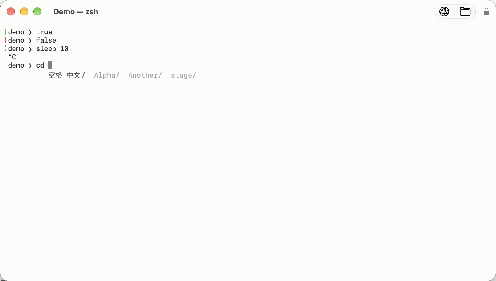

# User guide

[Documentation index](README.md) · [Project overview](../README.md)

Everything Corta does, and how to reach it. Each section says where the
feature lives — a menu, a shortcut, a setting — and links to the reference
that holds the details. Shortcuts are the defaults, and all but Find Next
and Find Previous can be changed ([Keyboard shortcuts](#keyboard-shortcuts)).

- [Install and update](#install-and-update)
- [Windows, tabs and panes](#windows-tabs-and-panes)
- [Text, fonts and themes](#text-fonts-and-themes)
- [Personalizing the terminal](#personalizing-the-terminal)
- [Scrollback, search and selection](#scrollback-search-and-selection)
- [Links and file references](#links-and-file-references)
- [Shell integration](#shell-integration)
- [The working directory](#the-working-directory)
- [Directory suggestions (zsh)](#directory-suggestions-zsh)
- [Remote work: SSH and SFTP](#remote-work-ssh-and-sftp)
- [Images in the terminal](#images-in-the-terminal)
- [The command palette](#the-command-palette)
- [The Quick Terminal](#the-quick-terminal)
- [macOS integration](#macos-integration)
- [Settings and the config file](#settings-and-the-config-file)
- [Keyboard shortcuts](#keyboard-shortcuts)
- [When something goes wrong](#when-something-goes-wrong)

## Install and update

Corta needs **macOS 26.0 or later** on a Mac with **Apple silicon**.
Download the `.zip` and its `.sha256` file from
[GitHub Releases](https://github.com/noah-qin/Corta/releases/latest), check
the archive, and move `Corta.app` to `/Applications`:

```sh
shasum -a 256 -c Corta-x.y.z.zip.sha256
unzip Corta-x.y.z.zip
```

Every release is signed with a Developer ID and notarised, so it opens
without a Gatekeeper warning. Launched from anywhere else, Corta offers to
move itself into `/Applications` (`suggest-applications-folder`).

**Updates.** **Corta ▸ Check for Updates…** checks now; a background check
runs once a day unless `update-auto-check = false`. An update is only
installed when you say so.

## Windows, tabs and panes

| To… | Use |
| --- | --- |
| Open a window / a tab | ⌘N / ⌘T |
| Previous / next tab | ⇧⌘[ / ⇧⌘] |
| Rename the current tab | Double-click the tab title, or right-click ▸ Rename Tab… |
| Split the pane to the right / downwards | ⌘D / ⇧⌘D |
| Move focus between panes | ⌥⌘ + arrow key |
| Resize the focused pane | ⌃⌘ + arrow key |
| Fill the window with one pane, and back | ⇧⌘↩ (Zoom Pane) |
| Make every pane the same size | Equalize Panes (command palette) |
| Close the pane, tab or window | ⌘W |
| Put back the pane you just closed | ⇧⌘T |

- Rename a tab directly in its title: double-click, or choose Rename Tab…
  from its right-click menu. Return saves, Esc cancels, and an empty name
  restores the automatic title. Custom names survive shell output and session
  restoration. The tab and terminal right-click menus also offer New Tab, and
  the toolbar's **+** button opens one even while a window has a single tab
  and no tab bar.
- **Zoom Pane** is temporary: nothing closes and no process is disturbed.
- **Reopen Closed Pane** restores the pane's place, size and working
  directory — not the program that was running in it.
- Closing a pane with a command still running asks first
  (`confirm-close`).
- **Restoring windows.** Quit and relaunch, and every window comes back
  with its splits, divider positions and each pane's working directory
  (`restore-windows`).
- **Presets.** A preset is a named shell, directory and environment,
  defined in the config file. **Shell ▸ New Pane with Preset** opens one;
  hold ⌥ to open it in a window of its own
  ([Presets](CONFIGURATION.md#4a-presets)).
- New windows open at `columns` × `rows` cells (120 × 30 by default).

## Text, fonts and themes

- **Font.** `font-family = system` (the only supported primary font) and
  `font-size` (12 pt). Settings ▸ Appearance previews the font, colors and cursor. Legacy font
  family names migrate to the system face.
- **Zoom.** ⌘= / ⌘− / ⌘0 or a pinch make the text bigger, smaller or
  the configured size again, in the current window only. Zoom never
  changes the config file. Font changes keep the window where it is and refit the visible rows and
  columns; a window with one pane and no tabs moves its bottom and right edges to whole cells so
  the text fills it exactly, and ⌘0 brings it back to the size it started at. Full-screen, maximised
  and tiled windows keep their size.
- **Theme.** Three built-in themes, `corta`, `solarized` and `mono`, each with light and dark variants;
  `appearance = auto` follows macOS as it switches. You can define your
  own theme through **View ▸ Theme editor…** or in the config file, or inherit
  from one and change a few
  colours ([Themes](CONFIGURATION.md#4-themes)).
- **Unicode.** Chinese, Japanese and Korean text takes two columns and
  lines up with everything else; emoji, combining marks, flags and emoji
  sequences are one cluster each. Characters the font lacks come from the
  system's fallback fonts. Standardized emoji presentation sequences (a text character followed
  by VS16, like ⚠️ or ✍️) take two columns; text presentation stays narrow.
- **Input methods.** Pinyin, Kana, Hangul and every other macOS input
  method compose in place, with the candidate window beside the cursor.
- **True colour.** 24-bit colour, the 256-colour palette, bold, italic,
  underline, strikethrough, dim and reverse.
- **⌥ as Meta.** Off by default, so ⌥ types the layout's characters. Set
  `option-as-meta = true` for Emacs-style Meta keys.
- **Bell.** A flash of the pane (`bell = visual`), or a sound
  (`bell = audible`).

## Personalizing the terminal

### Cursor appearance

Open Settings (⌘,) → Appearance → Cursor. Choose Block, Bar or Underline,
then enable Blink cursor if desired. The default is **Block, blinking off**.
The three shapes and independent switch provide six combinations. These are also `cursor-shape` and
`cursor-blink` in the configuration file. Changes apply to open panes.
Terminal programs can temporarily choose their own shape and blinking through
DECSCUSR; parameter 0 or a terminal reset returns to your configured defaults.
Blinking pauses when a pane is inactive, hidden or showing scrollback.

### Input-source indicator

The focused terminal shows a small badge in the window’s upper-right toolbar:
`A` for confirmed direct input, `中` for Chinese, `あ` for Japanese and `한`
for Korean. Other sources use their language code. Hover for the full source
name. A neutral badge identifies sources whose internal input mode is not
reported by macOS, including third-party IMEs with private English toggles.
Corta never guesses that mode from typed text and never changes the input source.

Settings ▸ Keyboard & Mouse ▸ Input Source Indicator chooses **Automatically**
(default), **Always in focused pane**, or **Off**. The default only
enables the indicator for users with an enabled non-Latin keyboard layout or
an IME; Latin-only keyboard setups remain uncluttered. Switching back to a Latin
layout keeps a quiet gray `A` on a faint gray background. Non-Latin layouts
and built-in IME modes use a soft indigo tint; unknown IME modes use gray. In the
toolbar the badge stays while a program runs — Claude Code, an editor — since
it covers no output. At the right edge of the command line, shell integration
hides it during command execution, and scrollback and alternate-screen programs
hide it.
The **Position** setting chooses **Window toolbar** (default) or **Right edge
of command line**. The toolbar badge sits independently of the network and
file buttons and stays fixed as commands grow or wrap. Turning it off or
choosing command-line placement removes its toolbar slot and separating space.
With command-line placement, long commands move the badge down to free space,
keeping it at the right edge;
it hides when no safe row remains and never inserts a line or scrolls the child.
Direct-input and IME colors accept hex values; clear a field for the subtle default styling.

[Chinese input-source badge](brand/input-source-indicator.png) ·
[Long-command avoidance](brand/input-source-long-command.png)

### Optional local system status

Open Settings (⌘,) → Terminal, enable Bottom status bar, then select the
metrics you want to see: CPU usage, system load,
memory usage, network rates, disk free space and thermal state. It is off
by default; each metric has its own toggle. Click the bar to see the local
host's name, macOS version, chip, core count and total memory. The bar says
Local even in an SSH pane; it does not monitor a remote server. In narrow
windows, click for the full selected metrics.

The network interface defaults to auto. It measures one primary interface,
so VPN traffic is not added to physical traffic. Enter a specific interface
name in Settings to measure it instead. Sampling stops while every enabled
bar is hidden. Thermal state is a four-level macOS report, not degrees.

### Creating and editing themes

Settings → Appearance → Create theme opens a graphical editor. Name your
copy, switch between dark and light variants, and change colors using color
pickers or HEX values. The preview updates without changing terminal windows.
Save theme activates and persists it; Cancel keeps your previous theme.
Custom themes offer Edit theme. Restore source colors resets the current
variant. You can still edit the same config file by hand. If that custom theme
changes outside the editor, reopen the editor before saving.

View → Theme editor opens graphical color editing directly. View → Local host details
shows host configuration without requiring the optional status bar. The same
host-details button is available in Settings → Terminal. Appearance previews
follow explicit mode changes immediately and show the selected cursor shape
and blink state. Terminal programs can still temporarily override cursor style.

### Compact Tab indentation (zsh)

In Settings → Terminal, install or update Shell Integration, then open a new
shell. With Corta's zsh shell integration installed or updated, Tab on a whitespace-only
command line inserts four spaces. Tab after command text retains the existing
completion binding. This is a ZLE widget; terminal output tab stops remain eight
columns, and full-screen programs continue receiving the Tab key. Without the
integration, the shell retains its own input-tab behavior.

The bottom status bar uses compact labels, a single-space separator, and short
byte units. Full names and precision remain in its tooltip, accessibility
value and host-details popover. Status, host and theme-editor text is translated
in all nine shipped languages and follows macOS's language choice for the app.

### Language and defaults

The app follows macOS’s preferred language for Corta: English, Simplified and
Traditional Chinese, Japanese, Korean, German, French, Spanish and Brazilian
Portuguese. Restart Corta after changing its app-language preference in macOS.
Numeric formatting follows the current locale. Existing explicit cursor and
status settings are preserved; defaults apply when those keys are absent.

These features arrived in 1.1.5. macOS 26+ and Apple silicon are required.

## Scrollback, search and selection

- **Scrolling.** The trackpad or wheel, or ⇧PageUp / ⇧PageDown, ⇧Home /
  ⇧End. Each session keeps `scrollback-lines` of history (10,000).
- **Search.** ⌘F opens the search bar over the scrollback; ⌘G and ⇧⌘G go
  to the next and previous match. **Match Case** and **`*`** (regular
  expression) toggle there, and remember their state in the config file
  (`search-case-sensitive`, `search-regex`). The bar sits at the top right
  of the pane and moves to the bottom while the cursor or the current match
  would be under it; in a narrow split it narrows rather than covering the
  pane. Each pane has its own bar.
- **Selecting.** Drag to select, double-click for a word, triple-click for
  a line. A finished selection is copied at once (`copy-on-select`); ⌘C
  copies too. Inside a program that uses the mouse — `vim`, `htop` — hold
  ⌥ while you start dragging to select text anyway
  (`mouse-override-modifier`).
- **Paste.** ⌘V. Pasted text is marked as a paste (bracketed paste), so a
  shell that supports it — zsh, fish, bash 5.1 or later — inserts a pasted
  command without running it until you press Return. When the program has
  not turned bracketed paste on (macOS's own `/bin/bash` 3.2 never does),
  Corta warns before pasting text that contains a line break. A large
  paste the shell is still working through can be cancelled with ⌃C: the
  part not yet sent is dropped and the interrupt goes straight through.
- **Export Text…** (⇧⌘S) saves the selection — or, with nothing selected,
  the whole scrollback and screen — to a file.
- **Clearing.** Three commands, because they discard different things:

  | Command | Screen | Scrollback | Modes and colours |
  | --- | --- | --- | --- |
  | Clear Screen (⌘K) | erased | kept | kept |
  | Clear History | kept | discarded | kept |
  | Reset Terminal | erased | discarded | reset |

  Clear History and Reset Terminal ask first and say how many lines they
  would discard — unless the scrollback is empty, or `confirm-close = false`
  turns the question off.

## Links and file references

- **URLs** show their target and the ⌘-click instruction on hover, and open with ⌘-click; set `link-activation = click` to open them
  with a plain click instead. Hold ⌘ over a link — including one a program
  marks explicitly (OSC 8, as `ls --hyperlink` prints) — to underline it
  and see its real target as a tooltip before you click; the click itself
  opens it at once.
- **File references.** A `path:line:column` in program output — a compiler
  error, a test failure — opens in your editor with ⌘-click. Tell Corta
  which editor with `open-file-command`, starting with the editor's full
  path, for example
  `open-file-command = /usr/local/bin/code --goto {file}:{line}:{column}`
  ([Following a file reference](CONFIGURATION.md#following-a-file-reference)).

Opening any file reference requires a configured `open-file-command`. Corta
never opens output-derived files in their system default application: some
file types run code when opened. After a connection failure, the next editing or upload action
connects again; failed uploads keep their pending decision.

## Shell integration

Shell integration lets Corta see where each command starts and ends. Install
it from **Settings ▸ Terminal ▸ Shell Integration**: it adds one marked block
to your shell's startup file — `~/.zshrc`; for bash both `~/.bashrc` and
`~/.bash_profile` (or whichever login file bash reads); or
`~/.config/fish/config.fish` — and **Remove** takes out exactly that block.
The startup-file block is only installed when you press the button. Standard
local zsh sessions also load Corta's bundled hooks automatically, without
editing your startup files, including the directory suggestions described below.

When Settings reports an outdated integration, choose **Update** and open a
new shell. Updating the app alone does not replace a previously installed
startup-file block. In 1.1.1 this loads the corrected command hooks: an empty
Return has no command result and draws no green or red rule.

With it installed:

- **Prompt marks.** A thin rule at the left of each prompt, green when the
  command succeeded and red when it failed. An empty Return draws no rule
  and creates no completed command-history entry.
- **Jumping.** ⌘↑ / ⌘↓ move between commands; ⇧⌘↑ / ⇧⌘↓ move between
  the ones that failed.
- **A command's output.** From the command palette: **Copy Last Command
  Output**, **Snapshot Running Command's Output** (what a build has printed
  so far), **Export Command Output…** to a file, and **Open File Reference
  in Command Output**, which opens the last `path:line` it printed.
- **Command History.** **Search Command History…** lists every command
  with its time, exit status and directory; **Fill** puts one back at the
  prompt and **Run** runs it again (`command-history-limit`).
- **Long-task notifications.** With `notify-on-long-task = true`, a command
  that ran longer than `notification-threshold` seconds (30) posts a
  notification when it finishes; click it to jump to the command.

Without shell integration these commands are disabled rather than silently
doing nothing, and notifications fall back to a guess based on typing and
output.

## The working directory

Corta knows the directory your shell is in when the shell reports it (shell
integration does). From the command palette:

- **Reveal Working Directory in Finder** and **Copy Working Directory Path**.
- **Change Directory to Parent** and **Change Directory to Project Root**
  (the nearest folder with `.git`) type the `cd` for you — only when no
  command is running and the prompt is empty.
- **Open Parent Directory in New Pane** and **Open Project Root in New
  Pane** split the pane with a shell started there.

The folder icon in the title bar is the directory too: drag it, or ⌘-click
it to see the path. With `directory-history` on, Corta remembers the
directories your commands ran in; **Settings ▸ Privacy & Security ▸ History** shows
how many and clears them.

## Directory suggestions (zsh)

Corta includes directory suggestions, enabled by default in standard local
zsh sessions. Type `cd ` to see folders in the current directory as faint
text below your input. Keep typing to filter the folders; a faint suffix
appears beside the cursor. For example, `cd De` can suggest `Developer/`.
Suggestions are previews: they are not part of your command until accepted.



While a suggestion is visible:

| Key | Action |
| --- | --- |
| Left / Right | Select the previous / next folder instead of moving the input cursor. |
| Tab | Fill the selected directory into the input; do not execute it. This replaces native Tab completion while suggestions are visible. |
| Esc | Dismiss suggestions for the current input. Press Esc before using Left / Right to edit the command, or again for the shell's own Esc action. |
| Up / Down | Keep the shell's normal command-history navigation. |
| Shift+Tab | Pass through to the shell's configured binding. |
| Return | Execute only the actual input; never automatically accept a faint suggestion. |

You can filter relative paths, subdirectories and `~/` paths. Hidden folders
appear when you type a dot prefix. Complex shell expressions keep native
completion. Bash and fish retain their own completion; this feature does not
automatically install hooks on remote machines or in custom shell commands.

**Optional: turn it off.** In **Settings ▸ Terminal ▸ Shell**, turn off
**Directory suggestions (zsh)**, or set this in your config file:

```ini
directory-completion = false
```

This immediately disables Corta's suggestions and key interception, leaving
the shell's native editing and completion available. Reopen the shell after
enabling it again. There is no startup-file block to delete for the automatic
local hooks. If you also installed shell integration manually, its **Remove**
button removes that separate startup-file block; removal is not needed to
turn off directory suggestions.

## Remote work: SSH and SFTP

Corta uses the system's OpenSSH — your `~/.ssh/config`, keys, agent and
`ProxyJump` all apply — and has no SSH implementation of its own.

- **The host badge.** A pane connected to another machine shows a badge
  at the front of the window title. It names the host when the remote shell
  reports it (shell integration installed there); otherwise it says the
  pane is remote without knowing which host.
- **Reconnect.** When an `ssh` or `mosh` session ends, **Reconnect to Host**
  runs the same command again, as a new connection.
- **Connecting.** The toolbar's globe and folder buttons open a sheet for an
  SSH terminal or an SFTP browser. It lists the hosts you connected to
  recently and the `Host` names in your `~/.ssh/config`; type to narrow the
  list, click one (or use ↑ and ↓ from the field) to fill it, double-click
  or press Return to connect. Settings ▸
  Privacy & Security ▸ Recent Hosts clears the recent ones.
- **Browse Remote Files…** opens an SFTP browser for the pane's host: list,
  upload, download, rename and delete. The first connection to a host asks
  you to confirm the host name. Transfers resume after an interruption and
  never overwrite a file without asking.
  A folder download stops if a name conflicts with a `.corta-part` staging
  file, preserving the existing file. Choose a separate destination or resolve
  that file individually; a folder-wide overwrite cannot consume a partial.
- **In the browser**, as in Finder: ⌘[ and ⌘] go back and forward, ⌘↑ to
  the enclosing folder, ⌘R refreshes, ⇧⌘G (or a click on the path) types a
  path, ⇧⌘N makes a folder and ⇧⌘. shows hidden files. Click a column title
  to sort. Right-click a row for its actions; double-click a folder to open
  it. Drop files from Finder on the listing — or on a folder row — to upload
  them, and drag a file out to Finder to download it. Transfers are under
  the toolbar's arrows button, with speed, time left and Show in Finder.
- **Editing a remote file.** **Edit** in the browser — or ⌘-clicking a
  `path:line` in a remote pane — downloads a copy and opens it in your
  editor. Uploading your changes is a separate, explicit step, and Corta
  checks first whether the remote file changed meanwhile.

The browser's connection has no terminal, so it cannot ask for a password:
use a key loaded in `ssh-agent`, and connect once in the terminal before
browsing a new host.

## Images in the terminal

Programs that speak the **kitty graphics protocol** can show images inline:

```sh
kitten icat picture.png
```

Images scroll with the text, stay in the scrollback, and are removed by
Clear Screen or Clear History along with the text around them. Other tools
that support the protocol, such as `timg` or `chafa`, can use it too, as
long as they send the image itself: Corta refuses by design to read a file
path a program names, and animation is not supported. A picture larger than the
pane is scaled to fit it.

## The command palette

⇧⌘P opens the command palette: every command Corta has, searchable by
name, with its shortcut beside it. Type a few letters and press Return.
Letters match in order, not necessarily together (`spr` finds Split Pane
Right); a group's name (`panes`) or a command's configuration name
(`new-tab`) finds it too. Commands you ran recently are listed first.
Clicking another window closes the palette and leaves that window in front.
It is the quickest way to reach the commands that have no default shortcut.

## The Quick Terminal

A terminal that drops down over whatever you are doing. Open it from
**View ▸ Quick Terminal**, from the command palette, or with a system-wide
hotkey once you turn one on:

```ini
quick-terminal = true
quick-terminal-key = alt+space
quick-terminal-position = top      # top, bottom or center
```

The hotkey is off by default, because a system-wide key is taken from
every other application.

## macOS integration

- **Shortcuts.** Three actions: **Open Corta Window** (optionally in a
  folder), **Focus Corta Window** and **Toggle Quick Terminal**. None of
  them runs a command in a shell.
- **Services.** Selected terminal text is offered to the **Services** menu.
- **Secure Keyboard Entry.** **Shell ▸ Secure Keyboard Entry** stops other
  applications from reading your keystrokes while Corta is in front — for
  typing passwords. A lock in the title bar shows when it is actually on.
- **VoiceOver** reads the terminal's text and follows the focused pane.
- **Clipboard from programs.** Off by default. With
  `allow-clipboard-write = true`, a program — including one inside `tmux`
  or over `ssh` — may put text on your clipboard (OSC 52). Nothing may read
  it back.

## Settings and the config file

All settings live in one text file, `~/.config/corta/config`. **Corta ▸
Settings…** (⌘,) edits the same file, and editing the file by hand is just
as supported:

Settings is a sidebar of categories, the way System Settings is laid out:

- **General** — the new-window size, restoring windows, confirming close,
  long-task notifications and updates.
- **Appearance** — light or dark, the system monospaced font, size, and a
  live preview, cursor shape/blinking and graphical theme editing.
- **Terminal** — scrollback, the command-history limit, the bell, search
  defaults, the open-file command, shell integration, optional system status
  and local host details.
- **Keyboard & Mouse** — Option as Meta, how links open, the modifier that
  selects text while a program owns the mouse, copy on select and input-source
  indicator modes/colors.
- **Shortcuts** — every command's key; a reset arrow appears beside one you
  have changed.
- **Quick Terminal** — the system-wide hotkey, position and screen.
- **Connections** — Connect with SSH, and saved presets.
- **Privacy & Security** — clipboard writes from programs (OSC 52), Secure
  Keyboard Entry, and the directory history.

These controls edit the same config file. Custom theme colors can be edited
graphically or through the file.

The window toolbar adds SSH and SFTP. Both open a sheet on the window that
accepts `user@host` or a config alias and suggests recent and configured
hosts; an empty SSH port respects OpenSSH configuration, and SFTP takes its
port from a `Host` alias. SFTP opens the remote pane's browser, or asks for a
host when the pane is local ([Remote work](#remote-work-ssh-and-sftp)).

```ini
theme = corta
appearance = auto
font-size = 14
scrollback-lines = 20000
notify-on-long-task = true
bind.equalize-panes = ctrl+cmd+e
```

Most settings apply at once; a few (window size, scrollback length) apply
to the next window or session. [Configuration](CONFIGURATION.md) lists
every key, its default and when it takes effect.

## Keyboard shortcuts

Change any shortcut with `bind.<command>` in the config file; an empty value
removes it, and the keystroke then reaches the program in the terminal:

```ini
bind.equalize-panes = ctrl+cmd+e
bind.close =
```

**Help ▸ Keyboard Shortcuts** shows the ones in effect in aligned columns;
commands without a binding are labelled **Not Set**. The terminal context
menu shows the same configured shortcuts.

The **Shell** menu keeps splitting, reopening and Clear Screen directly
available. Other tools are grouped under **Move Focus**, **Commands and
Output**, **Working Directory**, **Pane Layout**, and **Terminal and
Connection**.

The defaults, as of this version — [Keyboard shortcuts](CONFIGURATION.md#5-keyboard-shortcuts)
is the authoritative list:

| Command | Shortcut |
| --- | --- |
| New Window / New Tab | ⌘N / ⌘T |
| Close | ⌘W |
| Split Pane Right / Down | ⌘D / ⇧⌘D |
| Move Focus | ⌥⌘ + arrow |
| Resize Pane | ⌃⌘ + arrow |
| Zoom Pane | ⇧⌘↩ |
| Reopen Closed Pane | ⇧⌘T |
| Bigger / Smaller / Actual Size | ⌘= / ⌘− / ⌘0 |
| Find… / Find Next / Find Previous | ⌘F / ⌘G / ⇧⌘G (Find Next and Previous are fixed) |
| Copy / Paste / Select All | ⌘C / ⌘V / ⌘A |
| Scroll a page / to the top or bottom | ⇧PageUp, ⇧PageDown / ⇧Home, ⇧End |
| Previous / Next Command | ⌘↑ / ⌘↓ |
| Previous / Next Failed Command | ⇧⌘↑ / ⇧⌘↓ |
| Export Text… | ⇧⌘S |
| Clear Screen | ⌘K |
| Settings… | ⌘, |
| Command Palette… | ⇧⌘P |

Every other command — Equalize Panes, Clear History, Reset Terminal,
Browse Remote Files…, the command-output and working-directory commands —
has no default key and is one search away in the command palette.
[Keyboard shortcuts](CONFIGURATION.md#5-keyboard-shortcuts) has the full
table with each command's `bind.` name.

## When something goes wrong

[Troubleshooting](TROUBLESHOOTING.md) covers what you see when something
fails and how to fix it — a download macOS will not open, a font that is
refused, a shortcut that does nothing. [Features and limitations](FEATURES.md)
lists what Corta does not do yet. Report anything else on
[GitHub Issues](https://github.com/noah-qin/Corta/issues/new/choose).

### Development preview

Debug builds offer **Help ▸ SFTP Development Preview**, or launch with
`./script/build_and_run.sh --sftp-preview`. It opens the real file-browser
view with read-only fixtures and example transfer rows. Navigate `/home/demo`,
`src`, `docs`, and `empty` to inspect connected and empty listings. No server,
credentials, or local file staging is used. The preview menu and fixture
client are excluded from Release builds.

Remote-edit uploads check the remote content as well as size and modification
time. Each upload sends the version approved in the prompt. If the local copy
changes after that prompt, Corta asks for a new decision; further saves during
an upload remain pending edits. Managed copies remain on disk with private
file modes. Restored sessions retain arrangement and directory metadata,
with `restore-windows = true` by default, and start fresh processes without
restoring terminal text. See [data-at-rest policy](SECURITY.md#5-data-at-rest).
