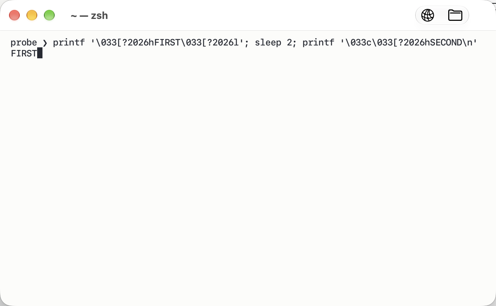
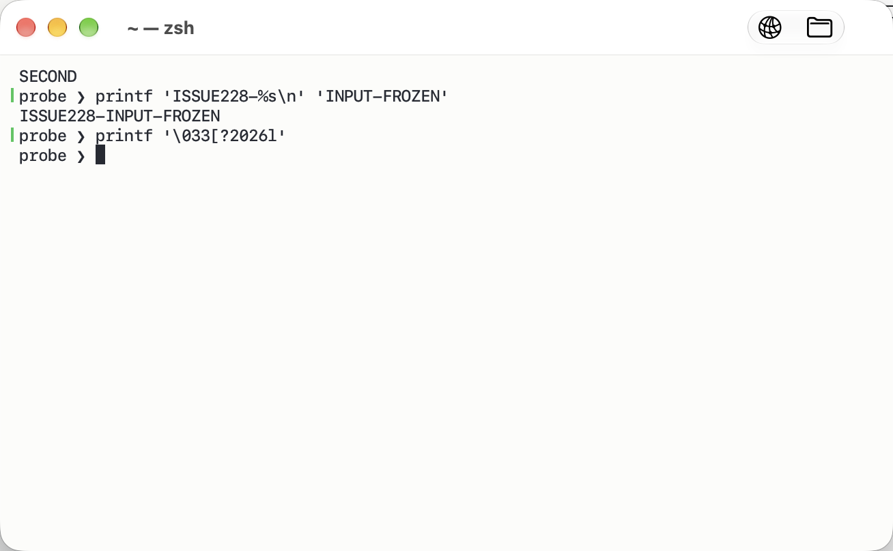

# Issue #228: terminal stops responding after inactivity

Date: 2026-10-06 (Asia/Shanghai)
Issue: https://github.com/noah-qin/Corta/issues/228
Reviewed checkout: `ab44e20`; compared relevant paths with `v1.1.1`.

This investigation records behavior before the fixes. The implementation and
its current verification are documented in
[the repair record](2026-10-06-issue-228-fix.md).

## Conclusion

No confirmed root cause of the reporter's intermittent freeze. The deeper
review did reproduce a separate permanent presentation hold caused by RIS
resetting the synchronized-output episode counter. It also reproduced a
regex search exceeding its budget and a search Escape leaking into the
terminal. Ordinary short idle periods preserve PTY input, output, and output
notifications; passing those tests does not cover these exception paths.

The report describes Corta 1.1.1 on an M1 Max running macOS 26.7.1, with no
comments, logs, input-source details, idle duration, or sleep/SSH information.
This machine runs macOS 27.0.1. Tests below ran against the current checkout,
not a launched 1.1.1 application on the reporter's machine.

## Reviewed paths

| Path | Result |
| --- | --- |
| `TerminalView+Keyboard`, `TerminalView+IME`, key encoding | No inactivity gate. Ordinary text may be consumed by `NSTextInputContext` and committed through `insertText`; control/command keys bypass IME. No evidence of an idle-specific failure. Unknown IME command selectors are ignored, but this does not explain all input stopping. |
| `TerminalView`, `PaneFocus`, `SplitViewController`, search, palette, tab rename, secure input | Initial focus and explicit focus restoration exist. Overlay views pass mouse input through. Search and rename restore the terminal responder on dismissal. App/window activation updates secure input. No deterministic idle-triggered loss of focus found. |
| `ViewController` input callbacks, `PanePointer` | Input is queued to the session; it scrolls to the bottom if necessary. A keypress at the bottom relies on the child's output to refresh the canvas. |
| `TerminalSession`, `PTY`, `GuardedDescriptor` | Reader and writer operate separately. System calls do not run while the descriptor-state mutex is held. Reader polling occurs every 250 ms during silence. Writer enqueue/drain transitions share a mutex; no lost writer restart found. `EINTR` is retried. |
| `OutputWakeGate`, `PaneFrameLoop`, `FrameScheduler` | Taking pending output re-arms the next wake. Pause/resume and frame preparation occur on the main actor; subsequent reader output queues a main-actor wake. No lost-wake interleaving established. |
| Window occlusion and `RenderPolicy` | Visibility changes resume/pause the link. Rate limits stay above zero. There is no explicit sleep/wake recovery that recreates a link or renderer; absence alone does not establish an OS failure. |
| `TerminalRenderer`, `Metal4Backend`, resource residency | GPU slot waits are bounded; dropped frames keep the scheduler running. Commit errors are logged. A permanently stalled queue can continue dropping frames indefinitely. |
| Synchronized output (`?2026`) | The usual one-second recovery works, but RIS can reset its episode counter and defeat detection of a subsequent episode. Permanent presentation hold reproduced; see the deeper findings below. |
| Spawn, shell integration, directory completion | No idle timer in the Corta shell integration found. Directory completion performs synchronous filesystem globbing in the child shell, but this feature postdates 1.1.1 and cannot explain this report. User shell plugins, terminal flow control, and SSH state remain unobserved. |

The PTY reader/writer, wake gate, and descriptor behavior are materially the
same in 1.1.1. Main frame preparation was subsequently extracted into
`PaneFrameLoop`; current passing tests are not proof that the release has
been fixed.

## Specific failure modes requiring evidence

1. **Unexpected PTY read errors can silently stop output processing.**
   `TerminalSession.runReaderLoop` treats any read error as EOF. It then
   waits for child exit; if the child is still alive and the wait expires,
   no `onChildExit` callback is delivered and the reader does not restart.
   Subsequent input can still be accepted while no new output is parsed.
   There is no read-error diagnostic establishing whether this happened
   to the reporter. Relevant code: `TerminalSession.swift:254` and the
   exit handling immediately after the reader loop.

2. **PTY write failure is not surfaced to the pane.**
   `drainPendingWrites` uses `try?` and discards a failed chunk. `.accepted`
   means admission to the queue, not successful delivery. Keyboard callbacks
   also ignore `.backpressured` and `.stopped`. A blocked writer can queue
   later keystrokes until the backlog cap is reached. A dead/non-reading
   child or I/O fault is necessary; silence alone does not cause this.
   Relevant code: `TerminalSession.swift:462` and
   `ViewController.swift:380`.

3. **GPU failure has diagnostics but no automatic reconstruction.**
   Metal commit feedback logs errors and releases slots; frame success
   returned to the scheduler describes encoding/admission, not eventual
   GPU success. The pane's completion closure records timing rather than
   recovering from errors. A permanently hung queue can leave the text
   unchanged while the app remains responsive. Relevant code:
   `Metal4Backend.swift:424`, `TerminalRenderer.swift:332`, and
   `PaneFrameLoop.swift:198`. No GPU fault from the reporter is available.

These are concrete exception-handling limitations, not confirmed causes
of #228. Do not close the issue or claim a fix on this evidence.

## Verification

All 155 selected tests passed, with no reported skips:

- Core: 59 tests in 10 suites covering PTY, session lifecycle/writes,
  lock fairness, wake coalescing, and synchronized-output recovery.
- App: 79 tests in 6 suites covering IME, key encoding, frame preparation,
  render policy, canvas presentation, and Metal 4 including a deliberately
  stalled GPU.
- App: 16 tests in 3 suites covering secure-input state changes, recovery,
  and cursor/window settings. `RecoveryUITests` is an app-hosted unit suite,
  not an XCUITest live-window reproduction.
- Added one real-PTY regression test,
  `TerminalSessionLifecycleTests.inputAndOutputResumeAfterRepeatedIdlePeriods`.
  Three one-second quiet intervals each span several reader poll deadlines.
  Terminal echo is disabled, and the child reads each marker and responds
  with its own prefix. The test checks both child delivery and subsequent
  output notification; all three cycles passed (3.198 seconds total).
- `git diff --check` passed.

Commands:

```sh
swift test --package-path CortaTerminal --filter 'TerminalSession|PTY|OutputWake|SynchronizedOutput'
swift test --package-path CortaTerminal --filter 'TerminalSessionLifecycleTests/inputAndOutputResumeAfterRepeatedIdlePeriods'
```

The app suites used `xcodebuild test`, scheme `Corta`, plan `Unit`, destination
`platform=macOS`, derived data `.build/ui`, ad-hoc signing, and selected
`-only-testing:CortaTests/<suite>` arguments.

Local logs: `/private/tmp/corta-228-core-tests.log`,
`/private/tmp/corta-228-app-tests.log`,
`/private/tmp/corta-228-focus-tests.log`, and
`/private/tmp/corta-228-idle-test.log`.

The first pass did not perform long unattended idle, actual system sleep,
live display-link recovery, or reporter-specific IME/SSH reproduction. The
second pass below adds short live idle/occlusion and presentation-hold tests.
Existing
frame-loop tests call frame preparation directly, and render-policy tests
inspect configuration rather than a real display link.

## Next diagnostic capture

Use the existing `input-latency` signposts (`keyDown`, `output`, `wake`,
`frame`, `commit`, `gpu`) and render fault logs during an actual recurrence.
`keyDown` marks delivery to the session callback, not receipt of every raw
AppKit event, so a missing marker requires checking the first responder and
IME handling too.

- Delivered input but no output: examine writer completion, reader state,
  child state, flow control, and remote connection.
- Output and wake but no frame: examine the display link, attachment,
  pause state, and visibility/sleep transitions.
- Frames and commits but no successful presentation: examine GPU feedback.
- No delivered input while menus respond: examine first responder/IME.
- Whole app unresponsive: capture thread stacks before restarting.

Production source was not changed; only the regression test and this report
were added.

## Deeper findings (second pass)

### A. RIS can defeat synchronized-output recovery — reproduced

**Priority: high. This can indefinitely hold the canvas while input and
PTY parsing still work.** The relevant implementation is also present in
`v1.1.1`; the reproduction ran against the current built core.

`Performer+Editing.swift:109` replaces mode state with `PerformerState()`
on RIS (`ESC c`), resetting `synchronizedOutputEpisode` to zero.
`TerminalSession.swift:281` detects a new episode by comparing the counter
before and after a parse slice. The following sequence defeats it:

1. Begin and end one synchronized-output episode: counter becomes 1.
2. Let its recovery timer expire while the mode is off.
3. In one subsequent parse slice, send RIS followed by `CSI ?2026 h`.
4. RIS changes the counter to 0; the new begin changes it to 1.
5. The before/after counters are both 1, so no new recovery timer is armed.
6. Without a later `CSI ?2026 l`, the mode stays enabled indefinitely.

The isolated real-PTY probe produced:

```text
secondReachedGrid=true
inputReachedGrid=true
syncStillEnabledAfterTimeout=true
```

A real-window XCUITest also confirmed the visible failure (15.555 seconds):
the accessibility snapshot contained `SECOND` and the subsequently executed
`ISSUE228-INPUT-FROZEN`, while the canvas remained on `FIRST`. Raw pixels
below the titlebar stayed identical across the new command. A subsequent
explicit `CSI ?2026 l` released the canvas and displayed the accumulated
output. The comparison excludes titlebar process-name updates and PNG
metadata; a preliminary whole-frame byte comparison was unsuitable because
the titlebar can change while the canvas is held.

Held canvas despite new parsed output:



After ending synchronized output:



The child sent the first completed episode, waited two seconds, then sent
RIS plus the second begin in one `printf`. The probe sent additional input
and waited another 1.4 seconds. Thus the old one-second timer was already
gone, the new input reached the grid, and the new episode remained active.
`PaneFrameLoop.prepareFrame` returns before the content diff while this
mode is enabled; 1.1.1's inline frame preparation has the same gate.

Mitigation direction: keep the episode identity monotonic across RIS, or
use an equivalent non-resetting session identity. Add tests for a reset and
new begin in one batch, and for old timers not ending a new episode early.
The reporter would need to have a program emitting this sequence; that
condition is not established by the issue.

### B. Regex timeout/cancellation is not an execution bound — reproduced

**Priority: medium to high for search responsiveness and resource use.**
The same search implementation exists in 1.1.1.

`Search.isCatastrophic` misses `^(a{1,3})+b$`: its group-body heuristic
counts unbounded braces but not an ambiguous bounded repetition.
`Search.findRegex` calls `enumerateMatches` with no progress option and
checks cancellation/deadlines outside the engine or after an actual match.
When the failing match attempt takes a long time, neither check runs.

The isolated probe linked the repository's actual `libCortaTerminal.a`:

| Input | Requested budget | Observed result |
| --- | --- | --- |
| 18 `a` characters | 50 ms | Guard false; finished in 4.536 ms |
| 28 `a` characters | 50 ms | Guard false; finished in 527.292 ms; then reported timeout |
| 32 `a` characters | 50 ms | Guard false; still running at 4 seconds; probe process killed |

These lines are far below the 64,000 UTF-16-unit length cap. The default
500 ms budget is subject to the same issue. Search runs in detached tasks,
so this proves stuck/slow search work, not a synchronous main-thread freeze.
Cancelling or closing a search does not interrupt that running match;
replacement queries can leave multiple CPU-consuming tasks and their grid
snapshots alive. Main-thread starvation from many such tasks was not measured.

The source's claim that an ICU attempt cannot be interrupted needs updating.
Apple documents a periodic callback via
[`.reportProgress`](https://developer.apple.com/documentation/foundation/nsregularexpression/matchingoptions/reportprogress).
A separate Foundation control using that option and checking the deadline
even when the match is nil stopped the same pattern on 120 `a` characters
after 50.066 ms (572 progress callbacks). This is an empirically validated
mitigation direction, not a hard real-time guarantee or a production fix.

### C. Search Escape reaches the terminal after dismissal — reproduced

**Priority: medium; unexpected input rather than an app deadlock.**

`PaneSearch.handleGlobalEscape` closes the search and returns nil, but its
installed monitor uses `self?.handleGlobalEscape(event) ?? event`.
The coalescing operator converts the deliberate nil back to the original
event. Closing the bar restores the terminal responder, which then receives
the same Escape. 1.1.1 uses the equivalent expression in
`ViewController+Search.swift:282`.

A temporary app-hosted test posted a real AppKit event through the installed
monitor, rather than calling `handleGlobalEscape` directly. Result:

```text
ISSUE228-MONITOR barClosed=true bytes=[[27]]
```

This matters for a vi-mode shell or TUI where Escape changes modes or closes
a screen. It does not explain every kind of idle freeze. Existing search
tests call the handler directly and consequently miss the installed closure's
behavior. Apple's
[event-monitor contract](https://developer.apple.com/documentation/appkit/nsevent/addlocalmonitorforevents(matching:handler:))
uses nil to stop event dispatch. Mitigation: distinguish a deallocated owner
from an existing owner's nil return.

### D. Terminal flow control can mimic a freeze — reproduced conditionally

This is expected terminal behavior, not a new implementation defect. A child
configured with `stty ixon -ixany -echo` paused output after Ctrl+S; typing
did not produce visible output, and Ctrl+Q released it:

```text
ready=true
outputBeforeCtrlQ=false
outputAfterCtrlQ=true
```

With IXANY enabled, subsequent ordinary input resumed output, so that control
did not reproduce a persistent pause. Do not infer that the reporter's shell
has the reproducing settings, or change terminal flow control globally based
on this probe. Corta does not itself disable IXON during PTY setup.

### E. Configuration hot reload can block the whole UI — static risk

`ConfigurationStore` is main-actor isolated. Both `reload` and the file
watcher's own-write comparison synchronously read the full config file;
parsing and notifying configuration consumers also occur on the main actor.
The watcher runs on `.main`, watches the parent directory, and has no file
size limit. A slow filesystem, network-backed/symlinked config, or abnormally
large config can delay all windows and keyboard handling during reload.
This path exists in 1.1.1. No slow-volume or large-config UI freeze was
reproduced. A FIFO probe was rejected immediately by Foundation with EACCES,
so FIFO blocking is explicitly not established here.

Mitigation direction: read/parse off the main actor with a bounded input
size, then apply a current result on the main actor. This is lower-priority
unless a recurrence shows the main thread inside config I/O/parsing.

### F. Idle SSH connections can be mistaken for terminal failure — conditional

`SSHDestination.preset` supplies the destination and optional port, leaving
OpenSSH liveness settings to the user's SSH config. On this machine,
`ssh -G -F /dev/null localhost` reports `serveraliveinterval 0`,
`tcpkeepalive yes`, and `connecttimeout none`. It makes no network connection.
An idle connection through a NAT or unreliable network can remain apparently
live until transport failure is detected; this affects a remote pane rather
than every local terminal. User config may supply keepalives. No network
failure was reproduced, and the issue does not establish SSH use.

### Additional exclusions and external comparison

- No display-link/reader mutex lock-order cycle like Ghostty's documented
  [CVDisplayLink deadlock](https://github.com/ghostty-org/ghostty/pull/14171)
  was found. Corta uses `CAMetalDisplayLink`, main-thread frame preparation,
  and no equivalent render mutex around a synchronous CVDisplayLink stop.
  That project's fix is background context, not evidence of Corta's cause.
- System-status sampling is performed by an actor, and only one sampling
  task is in flight; its slow disk probe does not synchronously read disk
  metadata on the main actor. No idle-notifier timer path that disables
  terminal input was found.
- A persistent search bar intentionally retains keyboard focus when the
  terminal canvas is clicked. This can explain typing in the search field,
  but is visible UI behavior rather than a reproduced loss of input.

### Second-pass evidence and scope

Isolated probe source/binary and temporary test source are under
`/private/tmp/corta228-research`. The monitor test log is `monitor-test.log`;
the one diagnostic test passed by confirming the unexpected delivery.
It was removed from the test target afterwards, so the ordinary suite does
not assert that a defect should remain present. No production fixes have
been applied.

Additional real-window verification:

- With cursor blinking disabled, 15 seconds of foreground idle followed by
  a command produced both observable command output and a changed screenshot.
- After minimizing for 10 seconds, restoring from the Window menu and
  executing another command also updated both the core text and screenshot.
  The live idle/occlusion test passed in 40.736 seconds. The screenshots were
  inspected and showed both output markers.
- The first attempt's shell command was rewritten by the active Chinese
  input method during XCTest event synthesis. That failure is not counted
  as a freeze. The successful run temporarily selected an ASCII input source
  and restored the original source afterwards.
- The real-window synchronized-output hold test confirmed continued input,
  unchanged canvas pixels, and recovery when synchronization ended. Its
  temporary source was likewise removed from the target after research.
- Test bundles/logs: `idle-ui-ascii.xcresult`, `idle-ui-ascii.log`,
  `sync-ui-canvas.xcresult`, and `sync-ui-canvas.log` under the research directory.

The live tests used disposable config/shell files, disabled restoration,
and terminated their test application afterwards. They do not cover actual
sleep, external-display disconnection, a long unattended period, or the
reporter's operating-system version and shell setup.

Recommended implementation order:

1. Preserve synchronized-output identity across RIS and add real-session
   coverage of the before/after identity collision and stale-timer cases.
2. Make regex deadline/cancellation checks reachable through progress
   callbacks, including nil-match callbacks; test an unrecognized bounded
   backtracking shape and a cancelled in-flight search.
3. Preserve a search handler's nil return in the installed event monitor;
   test actual event dispatch and absence of PTY bytes after dismissal.
4. Address the original I/O/GPU diagnostics gaps, then conditionally harden
   config reload if supported by observed main-thread stalls.

The three new implementation defects are substantiated independently of
#228. Only the synchronized-output defect has been shown here to reproduce
a permanently held terminal canvas with working input; none has yet been
matched to the reporter's actual recurrence.
